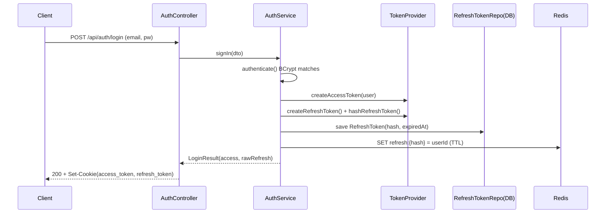
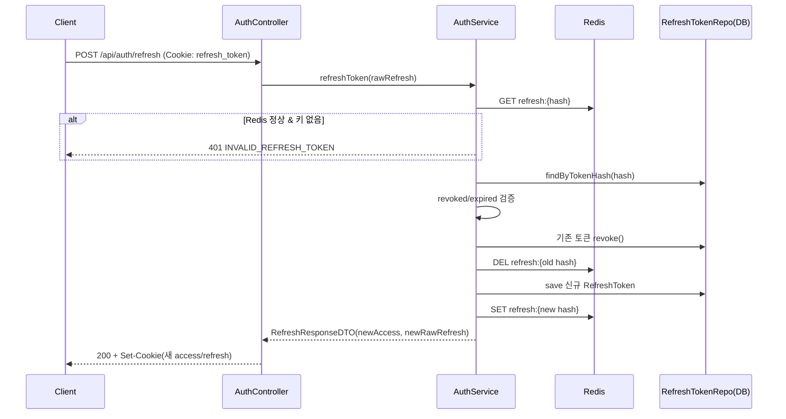
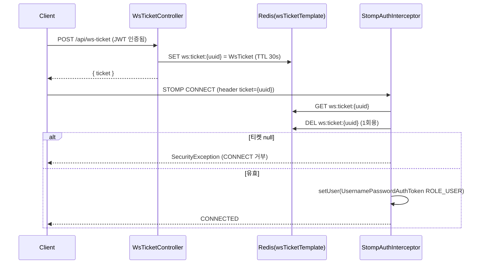
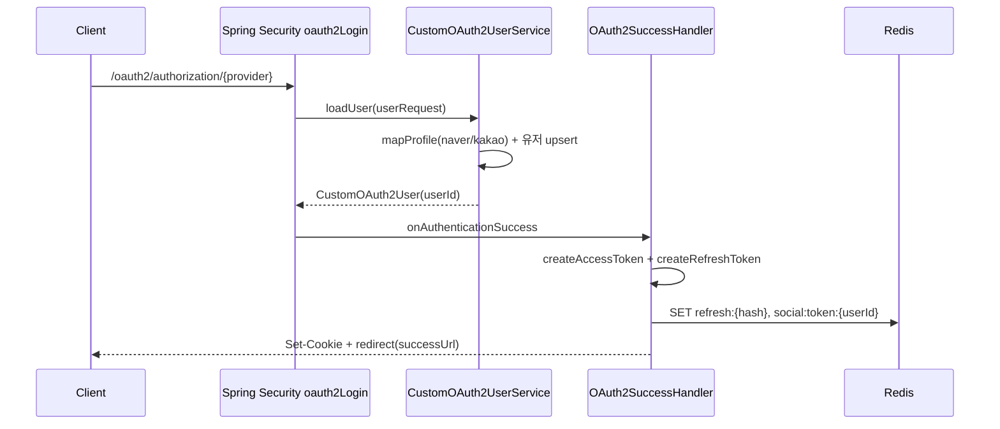

# 01. 인증/보안 도메인 상세 분석

> 대상: HonBam-api (Spring Boot 2.7)
> 분석 범위: `auth` 패키지 전체, `config`(보안/웹소켓/Redis/AuthProperties), `filter`, `interceptor`, WS 티켓 발급, `util/CookieUtil`, 전역 예외 처리
> 본 문서는 코드 정적 분석 결과이며, 모든 근거는 `파일:라인` 형식으로 명시한다.

---

## 1. 개요

### 1.1 도메인 책임 범위
인증/보안 도메인은 다음을 담당한다.

- **로컬(이메일/비밀번호) 로그인** 및 BCrypt 비밀번호 검증
- **JWT 액세스 토큰 발급/검증** (HS512, stateless)
- **불투명(opaque) Refresh 토큰 발급 / 회전(rotation) / 폐기**, DB + Redis 이중 저장
- **OAuth2 소셜 로그인 이원화**: ① 카카오 수동(authorization code → 토큰/유저 직접 호출), ② Spring Security 표준 `oauth2Login`(네이버/카카오)
- **쿠키 기반 토큰 전달** (`access_token`, `refresh_token`, HttpOnly)
- **WebSocket(STOMP) 핸드셰이크 인증**: 단기 1회용 티켓 발급 → CONNECT 시 Redis 검증
- **Spring Security 필터 체인 구성** 및 인증/인가 실패 처리

### 1.2 핵심 기능 요약
| 기능 | 진입점 | 비고 |
|---|---|---|
| 로컬 로그인 | `POST /api/auth/login` | 쿠키로 access/refresh 발급 |
| 토큰 재발급(회전) | `POST /api/auth/refresh` | 기존 refresh 폐기 후 신규 발급 |
| 로그아웃 | `POST /api/auth/logout` | 유저의 모든 refresh 폐기 |
| 로그인 검증 | `GET /api/auth/verify` | `authenticated` 불리언 반환 |
| 카카오 수동 로그인 | `GET /api/auth/kakaoLogin?code=` | RestTemplate로 카카오 직접 호출 |
| OAuth2 표준 로그인 | `/oauth2/**` (Spring Security) | 네이버/카카오, SuccessHandler 처리 |
| WS 티켓 발급 | `POST /api/ws-ticket` | 30초 TTL 1회용 티켓 |

---

## 2. 구성 요소

| 구분 | 파일 | 역할 |
|---|---|---|
| 엔티티 | `auth/entity/RefreshToken.java` | refresh 토큰 해시 영속화. `id`(uuid2), `userId`, `tokenHash`(len 512), `revoked`, `createdAt`, `expiredAt`, `deviceInfo`. `@PrePersist`에서 기본 만료 14일 설정(`RefreshToken.java:43-49`) |
| 리포지토리 | `auth/repository/RefreshTokenRepository.java` | `findByTokenHash`, `findAllByUserId`, `deleteAllByUserId` |
| 서비스 | `auth/service/AuthService.java` | 로컬 로그인/카카오 수동 로그인/refresh 회전/로그아웃(토큰 일괄 폐기)/중복검사/소셜 로그아웃 |
| 서비스 | `auth/service/CustomOAuth2UserService.java` | Spring Security 표준 OAuth2 흐름의 `loadUser`. 네이버/카카오 attribute 매핑, 유저 upsert, 프로필 이미지 동기화 |
| 토큰 | `auth/TokenProvider.java` | JWT 발급/파싱/검증, refresh 난수 생성 및 SHA-1 해싱 |
| 컨트롤러 | `auth/api/AuthController.java` | `/api/auth/*` 엔드포인트 |
| 컨트롤러 | `chatapi/api/WsTicketController.java` | `POST /api/ws-ticket` WS 입장 티켓 발급 |
| 필터 | `filter/JwtExceptionFilter.java` | 체인에서 발생한 `JwtException` 포착 → JSON 에러 응답 |
| 필터 | `filter/JwtAuthFilter.java` | Authorization 헤더/쿠키에서 토큰 추출 → 검증 → `SecurityContext` 설정 |
| 인터셉터 | `interceptor/StompAuthInterceptor.java` | STOMP CONNECT 프레임의 `ticket` 헤더를 Redis로 검증 후 Principal 주입 |
| OAuth2 핸들러 | `auth/OAuth2SuccessHandler.java` | 표준 OAuth2 성공 시 JWT/refresh 발급, 소셜 토큰 Redis 캐시, 프론트 리다이렉트 |
| OAuth2 핸들러 | `auth/OAuth2FailureHandler.java` | 실패 시 에러 쿼리 파라미터 붙여 리다이렉트 |
| 인증 주체 | `auth/CustomOAuth2User.java` | `OAuth2User` 구현. `getName()`이 시스템 userId 반환(`CustomOAuth2User.java:61-67`) |
| 인증 주체 | `auth/TokenUserInfo.java` | `@AuthenticationPrincipal`로 주입되는 경량 DTO(`userId`, `role`) |
| 설정 | `config/WebSecurityConfig.java` | 필터 체인, CORS, 인가 규칙, oauth2Login 등록 |
| 설정 | `config/WebSocketConfig.java` | STOMP 엔드포인트/브로커/인바운드 채널 인터셉터 |
| 설정 | `config/AuthProperties.java` | `auth.*` 프로퍼티 바인딩(토큰 만료, 쿠키 설정) |
| 설정 | `config/RedisConfig.java` | Lettuce 연결, RedisTemplate 3종, Pub/Sub 리스너 |
| 유틸 | `util/CookieUtil.java` | access/refresh `ResponseCookie` 생성/삭제 |
| 예외 | `exception/GlobalExceptionHandler.java` | `@RestControllerAdvice` 전역 예외 매핑 |
| DTO | `auth/dto/...` | `LoginRequestDTO`, `LoginResult`, `RefreshResponseDTO`, `KakaoUserDTO`, `ProviderProfile` 등 |

---

## 3. API 엔드포인트

### 3.1 AuthController (`/api/auth`)
| 메서드 | 경로 | 인증 요구 | 요약 | 근거 |
|---|---|---|---|---|
| POST | `/api/auth/login` | 공개(permitAll) | 이메일/비밀번호 로그인, access/refresh 쿠키 발급 | `AuthController.java:30-39`, `WebSecurityConfig.java:80` |
| POST | `/api/auth/logout` | 인증 필요 | `@AuthenticationPrincipal` userId의 모든 refresh 폐기, 쿠키 삭제 | `AuthController.java:42-56`, `WebSecurityConfig.java:120` |
| POST | `/api/auth/refresh` | 공개(permitAll) | `refresh_token` 쿠키로 회전 재발급. 쿠키 없으면 401 `NOT_REFRESH_TOKEN` | `AuthController.java:59-72`, `WebSecurityConfig.java:82` |
| GET | `/api/auth/kakaoLogin` | 공개(별도 규칙 없음→`anyRequest().authenticated()` 적용 여부 주의) | 카카오 수동 로그인(code 파라미터) | `AuthController.java:76-84` |
| GET | `/api/auth/verify` | 토큰 있으면 인증/없으면 null | `{authenticated: boolean}` 반환 | `AuthController.java:87-91` |

> 참고: `/api/auth/kakaoLogin`은 `WebSecurityConfig`에 명시적 `permitAll` 규칙이 없어 마지막 `anyRequest().authenticated()`(`WebSecurityConfig.java:130`)에 걸린다. 다만 `oauth2Login`/`/oauth2/**`와는 별개의 수동 경로이며, 토큰 없이 호출 시 401이 발생할 가능성이 있다(PLAUSIBLE — 실제 동작은 프로파일/설정에 따라 다름).

### 3.2 WsTicketController (`/api`)
| 메서드 | 경로 | 인증 요구 | 요약 | 근거 |
|---|---|---|---|---|
| POST | `/api/ws-ticket` | 인증 필요(`user==null`이면 401) | 30초 TTL 1회용 WS 입장 티켓 발급, Redis `ws:ticket:{uuid}` 저장 | `WsTicketController.java:31-56` |

---

## 4. 데이터 흐름

### 4.1 (a) 로컬 로그인 + 토큰 발급
1. `AuthController.signIn` → `AuthService.signIn`(`AuthService.java:76`)
2. `authenticate`로 이메일 조회 후 BCrypt 비교(`AuthService.java:64-74`)
3. access JWT 생성(`TokenProvider.createAccessToken`), refresh 난수 생성 + SHA-1 해시
4. `RefreshToken` 엔티티 DB 저장 + Redis `refresh:{hash}` 저장(`AuthService.java:83-93`)
5. 원본 refresh와 access를 쿠키로 내려줌(`AuthController.java:35-38`)

### 4.2 (b) Refresh 토큰 회전 (rotation)
`AuthService.refreshToken`(`AuthService.java:203-283`):
1. 쿠키의 원본 refresh를 해싱하여 `refresh:{hash}` Redis 키 조회. Redis 장애 시 `redisFail=true`로 우회(`AuthService.java:213-221`)
2. Redis 정상인데 키 없으면 `INVALID`(`:223-225`)
3. DB에서 `findByTokenHash` 검증: 없으면 `REVOKED`, `revoked==true`면 `REVOKED`, 만료면 `EXPIRED`(`:228-236`)
4. 기존 토큰 `revoke()` 처리 + Redis 키 삭제(`:246-254`)
5. 신규 access/refresh 발급 → 신규 `RefreshToken` DB 저장 + 신규 Redis 키 저장(`:256-279`)
6. `RefreshResponseDTO(newAccess, newRawRefresh)` 반환 → 컨트롤러가 새 쿠키 발급(`AuthController.java:64-71`)

### 4.3 (c) WS 티켓 발급 → STOMP CONNECT 검증
1. 인증된 사용자가 `POST /api/ws-ticket` 호출 → UUID 티켓 생성, Redis `ws:ticket:{uuid}`에 `WsTicket`(userId, expiredAt) 30초 TTL 저장(`WsTicketController.java:38-49`)
2. 클라이언트가 STOMP CONNECT 프레임의 `ticket` 네이티브 헤더로 전달
3. `StompAuthInterceptor.preSend`가 CONNECT일 때만 동작: 티켓 조회 후 **즉시 삭제**(1회용), null이면 `SecurityException`(`StompAuthInterceptor.java:41-47`)
4. `userId` 추출 후 `TokenUserInfo`/`UsernamePasswordAuthenticationToken`(ROLE_USER) 생성 → `accessor.setUser`(`:58-66`)

> 메시지 브로커는 `enableSimpleBroker("/topic","/queue")` (인메모리 SimpleBroker), 앱 prefix `/app`(`WebSocketConfig.java:64-67`). 엔드포인트는 `/ws-chat` + SockJS(`:55-60`).

### 4.4 (d) OAuth2 이원화 (카카오 수동 vs Spring Security 표준)

**경로 1 — 카카오 수동(`AuthService.kakaoService`, `AuthService.java:100-144`)**
- `GET /api/auth/kakaoLogin?code=`로 진입
- `getKakaoAccessToken`이 `RestTemplate`로 `kauth.kakao.com/oauth/token` 직접 호출(`:182-198`)
- `getKakaoUserInfo`가 `kapi.kakao.com/v2/user/me` 호출(`:171-180`)
- 미가입 시 유저 생성 + 프로필 이미지 저장, 이후 자체 access/refresh 발급 및 DB/Redis 저장
- Spring Security의 `oauth2Login`을 **거치지 않음**

**경로 2 — Spring Security 표준(`oauth2Login`)**
- `WebSecurityConfig.java:132-136`에서 `userService(customOAuth2UserService)`, `successHandler`, `failureHandler` 등록
- `CustomOAuth2UserService.loadUser`가 `DefaultOAuth2UserService`로 attribute 로딩 후 네이버/카카오 분기 매핑(`CustomOAuth2UserService.java:151-180`), 이메일 기준 유저 upsert
- 성공 시 `OAuth2SuccessHandler`가 JWT/refresh 발급 + 소셜 토큰 Redis 캐시 + 프론트 리다이렉트(`OAuth2SuccessHandler.java:50-120`)

> 두 경로는 동일하게 `TokenProvider`로 자체 JWT를 발급하지만, 진입/유저정보 획득 방식이 다르다. 수동 경로는 `kakaoService`가 카카오 API를 직접 호출하고, 표준 경로는 Spring Security 인프라(authorized client, attribute mapping)를 사용한다.

---

## 5. 영속성 / 토큰 저장

### 5.1 Refresh 토큰 이중 저장
- **원본 토큰**: `UUID + UUID` 난수 문자열(JWT 아님, opaque). `TokenProvider.java:59-61`
- **저장 형태**: 원본은 클라이언트 쿠키에만, 서버에는 **SHA-1 해시**만 저장(`hashRefreshToken`, `TokenProvider.java:64-66`)
- **DB(`refresh_token` 테이블)**: `tokenHash`(len 512), `userId`, `revoked`, `expiredAt`, `deviceInfo`, `createdAt`. `@PrePersist`로 `createdAt` 세팅 및 `expiredAt` 미지정 시 14일 기본값(`RefreshToken.java:43-49`)
- **Redis**: 키 `refresh:{hash}` → value `userId`, TTL = `auth.token.refreshExpireDuration`(`AuthService.java:92-93`). 빠른 검증/세션 무효화용 캐시
- **회전 시**: 기존 DB 토큰 `revoke()` + Redis 키 삭제, 신규 토큰 DB/Redis 동시 기록(`AuthService.java:246-279`)
- **로그아웃/전체 무효화**: `invalidateUserTokens`가 유저의 모든 토큰을 Redis 삭제 + DB `revoke()` 후 `saveAll`(`AuthService.java:294-311`). 메서드명상 "삭제"라 표기되나 실제로는 `revoke` 플래그 처리(물리 삭제 아님)

### 5.2 해싱 방식
- 실제 사용되는 해시: Spring의 `org.springframework.data.redis.core.script.DigestUtils.sha1DigestAsHex`(`TokenProvider.java:11,65`) → **SHA-1 16진수**
- 솔트/페퍼 없음. 단, 원본이 122자 가량의 고엔트로피 난수(UUID 2개)라 사전공격 위험은 낮음(PLAUSIBLE)
- 키/값 길이: DB `tokenHash` 컬럼은 512자이나 SHA-1 hex는 40자로 여유가 큼

### 5.3 소셜 토큰 Redis 캐시 (표준 OAuth2 한정)
- `OAuth2SuccessHandler`가 `OAuth2AuthorizedClientService`로 SNS access/refresh 토큰을 조회(`OAuth2SuccessHandler.java:78-90`)
- Redis Hash 키 `social:token:{userId}`에 `provider/accessToken/refreshToken` 저장, TTL = SNS 토큰의 `expiresAt`까지 남은 초(`:95-108`)
- 수동 카카오 경로(`kakaoService`)는 이 캐시를 만들지 않음(대신 `User` 엔티티에 카카오 access token 저장: `dto.toEntity(kakaoAccessToken)`, `AuthService.java:111`)

### 5.4 RedisTemplate 구성 (`RedisConfig.java`)
- `redisTemplate<String,Object>`: Key=String, Value=`GenericJackson2JsonRedisSerializer`(`:39-46`) — refresh/social 캐시용
- `wsTicketRedisTemplate<String,WsTicket>`: `Jackson2JsonRedisSerializer<WsTicket>` + JavaTimeModule(`:48-65`) — WS 티켓용
- `notificationRedisTemplate<String,String>`(`:67-74`)
- Pub/Sub: `chat:read:event`, `notification:*` 리스너 등록(`:77-88`)

---

## 6. 발견사항

각 항목은 **CONFIRMED**(코드로 직접 확인) / **PLAUSIBLE**(정황상 추론, 런타임 설정 의존)로 등급화한다.

### F-1. 만료 판별 문자열 불일치 — `TOKEN_EXPIRED` vs `contains("expired")` — CONFIRMED (HIGH)
- **근거**:
  - `TokenProvider.java:103-104` — `catch (ExpiredJwtException e) { throw new JwtException("TOKEN_EXPIRED"); }`
  - `JwtExceptionFilter.java:39` — `if (e.getMessage().contains("expired"))` → `ACCESS_TOKEN_EXPIRED`(401)
- **문제**: 메시지는 대문자 `"TOKEN_EXPIRED"`인데 필터는 소문자 `"expired"`를 부분검색한다. 자바 `String.contains`는 대소문자를 구분하므로 `"TOKEN_EXPIRED".contains("expired")`는 **false**. 결과적으로 만료 토큰은 `ACCESS_TOKEN_EXPIRED` 분기에 걸리지 못하고 마지막 fallback `INVALID_JWT`(401)로 응답된다(`JwtExceptionFilter.java:57`).
- **영향**: 클라이언트가 "만료"와 "무효"를 구분해 자동 refresh를 트리거하는 로직이라면 동작하지 않는다. 동일 패턴의 추가 불일치는 F-1b 참조.

### F-1b. 토큰 타입 오류 메시지도 불일치 — CONFIRMED (보너스)
- **근거**:
  - `TokenProvider.java:89` — `throw new JwtException("INVALID_TOKEN_TYPE:ACCESS");`
  - `JwtExceptionFilter.java:51` — `e.getMessage().contains("Invalid token type")`
- **문제**: 실제 메시지는 `INVALID_TOKEN_TYPE:ACCESS`인데 필터는 `"Invalid token type"`(다른 표기/대소문자)을 찾는다 → 불일치 → `INVALID_JWT`로 폴백. 또한 필터의 `"Not a refresh token"` 분기(`:45`)에 대응되는 메시지를 던지는 코드는 본 분석 범위에서 발견되지 않음(데드 분기, PLAUSIBLE).

### F-2. Refresh 해싱 라이브러리 혼용 (Spring DigestUtils vs Apache commons-codec) — CONFIRMED (LOW)
- **근거**:
  - `TokenProvider.java:11` — `import org.springframework.data.redis.core.script.DigestUtils;` (실제 사용: `:65` `sha1DigestAsHex`)
  - `OAuth2SuccessHandler.java:10` — `import org.apache.commons.codec.digest.DigestUtils;` (Apache commons-codec)
  - `build.gradle:79` — `implementation 'commons-codec:commons-codec:1.15'`
- **상세**: 실제 해싱은 전부 `TokenProvider.hashRefreshToken`(Spring DigestUtils)에 위임된다. `OAuth2SuccessHandler`도 `tokenProvider.hashRefreshToken(refresh)`를 호출(`OAuth2SuccessHandler.java:62`)하므로 Apache `DigestUtils` import는 **사용되지 않는 죽은 import**다. 즉 "혼용"이지만 런타임 해시 결과 불일치는 없다(두 라이브러리 모두 SHA-1 hex 동일 출력). 정리 대상(불필요 import/의존성 명확화)으로 분류.
- **등급**: import/의존성 사실은 CONFIRMED, 기능적 악영향 없음.

### F-3. WebSocketConfig의 RabbitMQ relay 설정값 미사용 (SimpleBroker 사용) — CONFIRMED (MEDIUM)
- **근거**:
  - `WebSocketConfig.java:39-52` — `app.rabbitmq.stomp.host/port/username/password/virtual-host` 5개 값을 `@Value`로 주입
  - `WebSocketConfig.java:64-67` — `configureMessageBroker`에서 `registry.enableSimpleBroker("/topic", "/queue")` 사용. `enableStompBrokerRelay` 호출은 코드베이스 전체에 없음(grep 결과 `WebSocketConfig` 5개 `@Value`만 매칭).
- **문제**: 주입된 relay 필드들(`relayHost`, `relayPort`, `clientLogin`, `clientPasscode`, `virtualHost`)은 어디에서도 참조되지 않는다. 외부 RabbitMQ STOMP relay를 쓰려던 흔적만 남고 실제로는 인메모리 SimpleBroker로 동작한다.
- **부작용(PLAUSIBLE)**: ① 다중 인스턴스 수평 확장 시 SimpleBroker는 인스턴스 간 메시지 공유 불가(브로드캐스트 누락 가능). ② `app.rabbitmq.stomp.*` 프로퍼티가 설정 파일에 정의돼 있지 않으면 `@Value`가 기본값 없이 선언돼 있어 컨텍스트 기동이 실패할 수 있음(특히 `int relayPort`). 본 레포에는 `application.yml`이 포함돼 있지 않아(외부 주입/gitignore 추정) 실제 기동 여부는 확인 불가 → PLAUSIBLE.

### F-4. OAuth2SuccessHandler가 refresh 쿠키에 원본이 아닌 해시를 저장 — CONFIRMED 코드 / 영향 PLAUSIBLE (HIGH)
- **근거**:
  - `OAuth2SuccessHandler.java:61-62` — `refresh`(원본 난수)와 `refreshHash`(해시) 분리 생성
  - `OAuth2SuccessHandler.java:75` — Redis/DB에는 `refresh:{refreshHash}`로 **해시** 저장(정상)
  - `OAuth2SuccessHandler.java:116` — `cookieUtil.createRefreshCookie(refreshHash)` — **쿠키에 해시를 그대로 넣음**
- **대조**: 로컬 로그인/회전 경로는 쿠키에 **원본**을 넣는다(`AuthController.java:37`은 `result.getRefreshToken()`=원본, `AuthService.signIn`이 원본 반환).
- **문제(PLAUSIBLE)**: `AuthService.refreshToken`은 들어온 쿠키값을 다시 SHA-1 해싱하여 키를 만든다(`AuthService.java:206`). 표준 OAuth2 로그인 사용자는 쿠키에 이미 해시가 들어 있으므로, refresh 시도 시 `hash(hash)`로 조회 → DB/Redis 어디에도 매칭되지 않아 회전이 실패할 가능성이 크다. 즉 OAuth2 표준 로그인 사용자는 토큰 재발급이 동작하지 않을 개연성이 있다. 런타임 검증은 못 했으나 코드상 명백한 비대칭 → 코드 사실은 CONFIRMED, 사용자 영향은 PLAUSIBLE.

### F-5. 전역 예외 처리의 광범위 fallback — CONFIRMED (LOW)
- **근거**: `GlobalExceptionHandler.java:70-74`의 `RuntimeException` 핸들러가 모든 런타임 예외를 **400 Bad Request + 평문 메시지**로 응답. `:77-80`은 그 외 `Exception`을 500으로 처리.
- **문제(PLAUSIBLE)**: 도메인별로 적절한 상태코드(404/403/409 등)를 가져야 할 예외가 별도 핸들러에 매핑되지 않으면 일괄 400으로 뭉뚱그려질 수 있다. 또한 예외 메시지를 그대로 노출하여 내부 정보 누출 가능성(보안 관점, LOW).

### F-6. CORS가 localhost 패턴에 한정 + credentials 허용 — CONFIRMED (정보)
- **근거**: `WebSecurityConfig.java:148-162` — `setAllowCredentials(true)`, origin 패턴은 `http://localhost:*`, `http://127.0.0.1:*`만 허용. 운영 도메인은 미포함(개발 설정 상태). `csrf().disable()`(`:55`) + 쿠키 인증 조합이므로 운영 전 origin 화이트리스트/`SameSite` 점검 필요(PLAUSIBLE).

### F-7. 인가 규칙 중복/순서 의존 — CONFIRMED (정보)
- **근거**: `WebSecurityConfig.java:86-130`에서 `/api/posts/**`, `/api/freeboard/**`가 GET permitAll(`:88-89`) 후 동일 패턴 authenticated(`:100,103`)로 중복 선언. Spring Security는 선언 순서대로 매칭하므로 GET 공개 → 그 외 인증으로 의도대로 동작하나, 규칙이 장황하고 순서 의존적이라 유지보수 리스크 존재(LOW).

---

### 발견사항 등급 요약
| ID | 내용 | 등급 | 심각도 |
|---|---|---|---|
| F-1 | `TOKEN_EXPIRED` vs `contains("expired")` 만료 판별 실패 | CONFIRMED | HIGH |
| F-1b | `INVALID_TOKEN_TYPE:ACCESS` vs `"Invalid token type"` 불일치 | CONFIRMED | MEDIUM |
| F-2 | Spring/Apache `DigestUtils` 혼용(Apache는 죽은 import) | CONFIRMED | LOW |
| F-3 | RabbitMQ relay 값 주입했으나 SimpleBroker 사용 | CONFIRMED(코드)/PLAUSIBLE(영향) | MEDIUM |
| F-4 | OAuth2 성공 시 refresh 쿠키에 원본 아닌 해시 저장 | CONFIRMED(코드)/PLAUSIBLE(영향) | HIGH |
| F-5 | 전역 예외 광범위 400/500 fallback | CONFIRMED/PLAUSIBLE | LOW |
| F-6 | CORS localhost 한정 + credentials | CONFIRMED | 정보 |
| F-7 | 인가 규칙 중복/순서 의존 | CONFIRMED | LOW |
