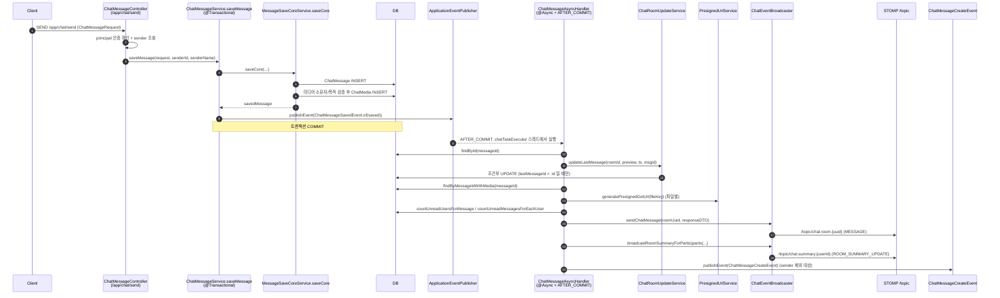
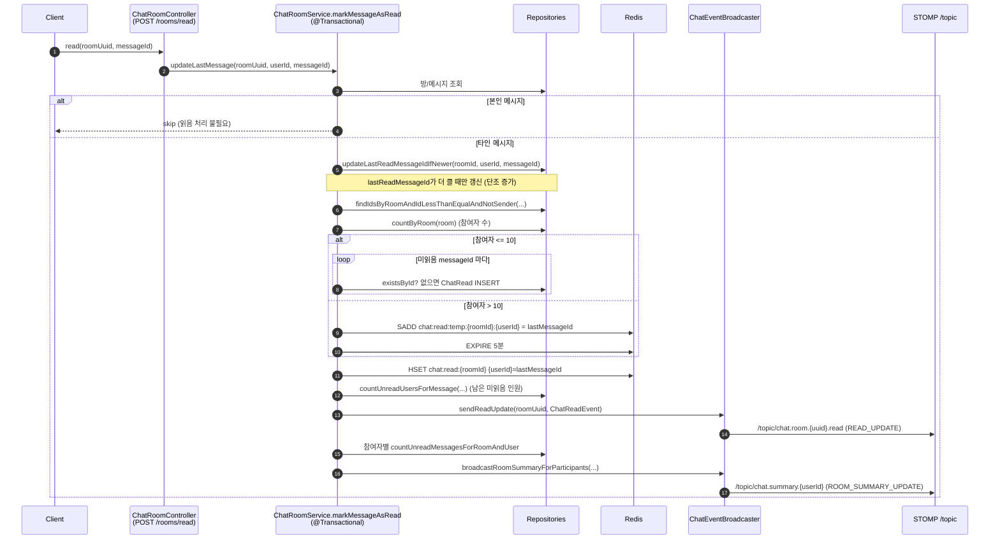

# 02. 실시간 채팅 도메인 상세 분석

> 대상: `com.example.HonBam.chatapi` 패키지 전체 + WebSocket / Async / Redis 설정
> Spring Boot 2.7 / STOMP over WebSocket(SockJS) / JPA / Redis
> 본 문서는 코드를 직접 읽어 작성하였으며, 추정이 포함된 항목은 6장에서 등급(CONFIRMED / PLAUSIBLE)으로 구분한다.

---

## 1. 개요

### 1.1 책임 범위
채팅 도메인은 다음 세 가지 형태의 대화를 모두 한 모델(`ChatRoom`)로 표현한다.

| 형태 | 식별 방식 | 비고 |
| --- | --- | --- |
| 1:1 (Direct) | `is_direct = true`, 참여자 2명 | 생성 시 양쪽 사용자 PK를 정렬해 비관적 락 후 기존 방 재사용 (`checkDirectRoomExistence`) |
| 그룹 (Group) | `is_direct = false`, `is_open = false` | 참여자 3명 이상이 되면 `convertToGroup()`으로 Direct→Group 자동 승격 |
| 오픈 (Open) | `is_open = true` | `allow_join_all = true`면 초대 없이 자유 입장 가능 |

핵심 기능: 방 생성/입장/초대, 메시지 송수신(텍스트 + 미디어 첨부), 메시지 목록 조회(커서/페이징), 읽음 처리 및 안읽음 카운트 집계, 방 목록 요약(unread) 실시간 갱신.

### 1.2 핵심 설계 포인트
1. **WebSocket 티켓 인증 분리** — STOMP CONNECT 시 JWT를 직접 싣지 않고, REST(`POST /api/ws-ticket`)로 단기(기본 30초 TTL) 1회용 티켓을 Redis에 발급한다. 클라이언트는 이 티켓을 CONNECT 헤더에 실어 보내고 `StompAuthInterceptor`가 검증 후 즉시 삭제(1회용)한다. 인증 토큰을 WS 핸드셰이크 URL/헤더에 노출하지 않기 위한 분리 설계.
2. **이벤트 기반 비동기 후처리** — 메시지 저장(`saveMessage`)은 본 트랜잭션에서 DB INSERT만 수행하고, 브로드캐스트/미디어 presigned URL 생성/unread 집계/알림 같은 무거운 후처리는 `ChatMessageSavedEvent`를 발행한 뒤 `@Async + @TransactionalEventListener(AFTER_COMMIT)`로 분리한다. 송신 응답 지연과 후처리 실패의 트랜잭션 전파를 차단.
3. **Redis 활용** — (a) WS 티켓 저장소, (b) 읽음 위치 캐시(`chat:read:{roomId}` 해시), (c) 대규모 방 읽음 임시 버퍼(`chat:read:temp:*` set) + 스케줄러 flush, (d) 크로스 인스턴스 읽음 동기화용 Pub/Sub 구독(`chat:read:event`) — 단, (d)는 발행자 부재로 미완성(6장 참고).

---

## 2. 구성 요소

### 2.1 엔티티
| 파일 | 역할 |
| --- | --- |
| `chatapi/entity/ChatRoom.java` | 채팅방. `roomUuid`(외부 노출), `lastMessage/lastMessageId/lastMessageTime` 비정규화 필드 보유. `convertToGroup(count, name)`으로 Direct→Group 승격 |
| `chatapi/entity/ChatRoomUser.java` | 방-사용자 멤버십. `lastReadMessageId`로 사용자별 읽음 위치 추적 |
| `chatapi/entity/ChatMessage.java` | 메시지 본문. `senderId/senderName` 비정규화 저장, `@CreationTimestamp timestamp` |
| `chatapi/entity/ChatMedia.java` | 메시지-미디어 연결(N:1 message, N:1 `upload.Media`) |
| `chatapi/entity/ChatRead.java` | 읽음 레코드(메시지×사용자). 복합키 `ChatReadId` 사용 |
| `chatapi/entity/ChatReadId.java` | `@Embeddable` 복합키 (`messageId`, `userId`) |
| `chatapi/entity/MessageType.java` | enum: `TEXT, FILE, IMAGE, VIDEO, SYSTEM` |

### 2.2 리포지토리
| 파일 | 역할 |
| --- | --- |
| `chatapi/repository/ChatRoomRepository.java` | 방 조회(uuid/open/keyword), `findDirectRoom`, 조건부 원자 `updateLastMessage`(lastMessageId 단조 증가 보장) |
| `chatapi/repository/ChatRoomUserRepository.java` | 멤버십 조회/카운트, unread 집계 네이티브 쿼리 3종, `updateLastReadMessageIdIfNewer`(조건부 원자 갱신) |
| `chatapi/repository/ChatMessageRepository.java` | 메시지 페이징/커서 조회, unread 카운트, `findIdsByRoomAndIdLessThanEqualAndNotSender`(읽음 대상 id 목록) |
| `chatapi/repository/ChatReadRepository.java` | `ChatRead` CRUD + `existsById` |
| `chatapi/repository/ChatMediaRepository.java` | 메시지별 미디어 fetch join 조회 |

### 2.3 서비스
| 파일 | 역할 |
| --- | --- |
| `chatapi/service/ChatMessageService.java` | 송신 진입점 `saveMessage`(core 호출 + 이벤트 발행), 메시지 목록 조회/DTO 조립(presigned URL 포함) |
| `chatapi/service/MessageSaveCoreService.java` | `saveCore` — 메시지 INSERT, 미디어 소유자/목적(`MediaPurpose.CHAT`) 검증 후 `ChatMedia` 저장 |
| `chatapi/service/ChatRoomService.java` | 방 생성/입장/초대/Direct, 읽음 처리 핵심 로직(`markMessagesAsReadInternal`), unread 브로드캐스트 |
| `chatapi/service/ChatRoomUpdateService.java` | 별도 트랜잭션 경계로 방 `lastMessage` 비정규화 필드 갱신 |

### 2.4 컨트롤러
| 파일 | 역할 |
| --- | --- |
| `chatapi/api/ChatRoomController.java` | REST `/api/chat/rooms/**` — 방 생성/목록/입장/Direct/초대/오픈목록/읽음 |
| `chatapi/api/ChatMessageController.java` | REST `/api/chat/messages/**`(목록·커서) + STOMP `@MessageMapping("/chat/send")` |
| `chatapi/api/WsTicketController.java` | `POST /api/ws-ticket` — Redis 1회용 WS 티켓 발급(TTL `${websocket.ticket.ttl:30}`초) |

### 2.5 이벤트 / 리스너 / 컴포넌트 / 스케줄러
| 파일 | 역할 |
| --- | --- |
| `chatapi/event/ChatMessageSavedEvent.java` | 저장 직후 발행되는 도메인 이벤트(messageId/roomId/roomUuid/senderId만 담는 경량 DTO) |
| `chatapi/event/ChatMessageAsyncHandler.java` | `@Async("chatTaskExecutor") + @TransactionalEventListener(AFTER_COMMIT)` 후처리: lastMessage 갱신, presigned URL, unread 계산, 브로드캐스트, 알림 이벤트(`ChatMessageCreateEvent`) 발행 |
| `chatapi/component/ChatEventBroadcaster.java` | `SimpMessagingTemplate` 래퍼. `/topic/chat.room.{uuid}`(MESSAGE), `.read`(READ_UPDATE), `/topic/chat.summary.{userId}`(ROOM_SUMMARY_UPDATE) 전송 |
| `chatapi/listener/ChatEventSubscriber.java` | Redis `chat:read:event` 채널 구독자. 수신 JSON을 STOMP `.read` 토픽으로 재브로드캐스트(크로스 인스턴스 의도) |
| `chatapi/scheduler/ChatReadFlushScheduler.java` | `@Scheduled(fixedDelay=60000)` — `chat:read:temp:*` set을 1분마다 `ChatRead`로 flush |
| `interceptor/StompAuthInterceptor.java`(채팅 인증 보조) | STOMP CONNECT 가로채 티켓 검증 → `UsernamePasswordAuthenticationToken` 주입 후 티켓 삭제 |

### 2.6 설정
| 파일 | 역할 |
| --- | --- |
| `config/WebSocketConfig.java` | `/ws-chat` SockJS 엔드포인트, **SimpleBroker**(`/topic`,`/queue`), 앱 prefix `/app`, inbound 채널에 `StompAuthInterceptor` 등록 |
| `config/AsyncConfig.java` | `chatTaskExecutor`(core 10/max 50/queue 1000, `CallerRunsPolicy`) |
| `config/RedisConfig.java` | Lettuce 연결, `redisTemplate`/`wsTicketRedisTemplate`/`notificationRedisTemplate`, `RedisMessageListenerContainer`에 `chat:read:event`·`notification:*` 리스너 등록 |

---

## 3. API 엔드포인트

### 3.1 REST
| 메서드 | 경로 | 처리 | 설명 |
| --- | --- | --- | --- |
| POST | `/api/ws-ticket` | `WsTicketController.issueTicket` | WS 1회용 티켓 발급 |
| POST | `/api/chat/rooms` | `ChatRoomController.createRoom` | 방 생성(Direct/Group/Open 분기) |
| GET | `/api/chat/rooms` | `chatRoomList` | 내가 속한 방 목록(+unread/lastMessage) |
| POST | `/api/chat/rooms/join` | `joinRoomOnEnter` | 방 입장(오픈+allowJoinAll이면 멤버 자동 추가) |
| POST | `/api/chat/rooms/direct` | `startDirectChat` | 1:1 채팅 시작/재사용 |
| POST | `/api/chat/rooms/{roomUuId}/invite` | `inviteUser` | 사용자 초대 (주의: 6장 ④) |
| GET | `/api/chat/rooms/open` | `openChatRoomList` | 오픈 방 목록/검색(keyword) |
| POST | `/api/chat/rooms/read` | `updateReadMessage` | 읽음 처리(roomUuid, messageId) |
| GET | `/api/chat/messages` | `getMessages` | 방 최근 메시지 50개 |
| GET | `/api/chat/messages/cursor` | `getMessagesCursor` | 커서(before) 페이징, 기본 size 30 |

### 3.2 STOMP
| 종류 | 목적지 | 처리/설명 |
| --- | --- | --- |
| 핸드셰이크 | `/ws-chat` (SockJS) | CONNECT 시 `ticket` 네이티브 헤더 필요 |
| `@MessageMapping` | `/app/chat/send` | `ChatMessageController.sendMessage` — 인증 확인 후 `saveMessage` 호출 |
| SUBSCRIBE | `/topic/chat.room.{roomUuid}` | 메시지 본문(MESSAGE) 수신 |
| SUBSCRIBE | `/topic/chat.room.{roomUuid}.read` | 읽음 갱신(READ_UPDATE) 수신 |
| SUBSCRIBE | `/topic/chat.summary.{userId}` | 방 목록 요약(ROOM_SUMMARY_UPDATE) 수신 |

> 송신 경로는 STOMP, 메시지 목록 조회는 REST로 이원화되어 있다.

---

## 4. 데이터 흐름

### 4.1 (a) 메시지 송신 전체 체인

**핵심 포인트**
- 송신 트랜잭션은 INSERT만, 모든 부가 작업은 COMMIT 이후 비동기 스레드(`chatTaskExecutor`)에서 실행 → 커밋된 데이터를 안전하게 재조회.
- `makePreview()`가 메시지 타입별 미리보기 텍스트(`[파일]`,`[사진]`,`[영상]`)를 만들어 방 목록 표시에 사용.
- 후처리 전체가 `try/catch`로 감싸져 있어 브로드캐스트 실패가 알림/요약 흐름을 끊더라도 로그만 남고 송신 자체는 이미 성공.
- 알림 대상은 참여자에서 `senderId`를 제외한 목록이며, 비어있지 않을 때만 `ChatMessageCreateEvent`를 발행(notification 도메인으로 위임).

### 4.2 (b) 읽음 처리 흐름

진입점은 두 곳: REST `POST /api/chat/rooms/read`(`markMessageAsRead`)와 입장 시 전체 읽음(`markAllAsReadOnJoin`). 둘 다 `markMessagesAsReadInternal`로 수렴한다.

**스케줄러 보조 흐름(대규모 방)**: 참여자 >10 방은 즉시 DB INSERT 대신 Redis temp set에 적재만 하고, `ChatReadFlushScheduler.flushChatReads()`가 1분마다 `chat:read:temp:*` 키를 순회하여 미존재 `ChatRead`만 일괄 INSERT한다.

---

## 5. 영속성 / 동시성 전략

### 5.1 lastRead 조건부 원자 갱신
- `ChatRoomUserRepository.updateLastReadMessageIdIfNewer` (`ChatRoomUserRepository.java:86-92`): `WHERE ... AND (lastReadMessageId IS NULL OR lastReadMessageId < :messageId)`. 동시 읽음/순서 역전 시에도 읽음 위치가 뒤로 후퇴하지 않도록 DB 레벨에서 단조 증가 보장.
- `ChatRoomRepository.updateLastMessage` (`ChatRoomRepository.java:34-44`)도 동일하게 `lastMessageId < :messageId`일 때만 UPDATE → 비동기 후처리 순서가 뒤바뀌어도 방 미리보기가 과거 메시지로 덮이지 않음.

### 5.2 Direct 방 비관적 락
- `checkDirectRoomExistence` (`ChatRoomService.java:141-151`): 두 사용자 PK를 사전순 정렬(`firstId/secondId`)한 뒤 `userRepository.findByIdWithLock`로 **항상 같은 순서**로 락을 획득. 두 사용자가 동시에 서로에게 1:1 방을 만들 때 중복 방 생성 및 데드락(락 순서 불일치)을 방지하는 의도.

### 5.3 참여자 수 분기 (≤10 즉시 DB / >10 Redis temp)
`markMessagesAsReadInternal` (`ChatRoomService.java:412-465`):
- `participantCount <= 10`: 읽음 대상 메시지 id를 순회하며 `existsById` 확인 후 `ChatRead` 즉시 INSERT(`getReferenceById`로 프록시 사용, 삭제 메시지는 `EntityNotFoundException` catch 후 skip).
- `participantCount > 10`: `chat:read:temp:{roomId}:{userId}` set에 `lastMessageId`만 SADD + 5분 TTL → 대규모 방의 읽음당 INSERT 폭주를 1분 배치로 분산.
- 두 경로 모두 `chat:read:{roomId}` 해시에 사용자별 마지막 읽은 id를 캐시.

### 5.4 unread 쿼리 전략
| 쿼리 | 위치 | 용도 |
| --- | --- | --- |
| `countUnreadUsersForMessage` | `ChatRoomUserRepository.java:51-56` | 단일 메시지의 "안읽은 인원 수"(말풍선 N) |
| `countUnreadUsersForMessages` | `:59-66` | 메시지 목록 일괄 안읽음 인원(Map) |
| `countUnreadMessagesForEachUser` | `:68-76` | 방 내 사용자별 안읽은 "메시지 수"(요약 LEFT JOIN) |
| `countUnreadMessagesForRoomAndUser` | `ChatMessageRepository.java:62-70` | 특정 사용자의 방 unread(서브쿼리 COALESCE) |
| `countUnreadMessages` / `countByRoomIdAndSenderIdNot` | `ChatMessageRepository.java:23-31` | 방 목록 화면 unread(lastRead 유무 분기) |

> unread 집계는 `ChatRead` 테이블이 아니라 대부분 `ChatRoomUser.lastReadMessageId`(읽음 워터마크) 기반으로 계산한다. `ChatRead`는 메시지 단위 읽음 상세를 위한 별도 적재이며 두 모델이 병존한다.

---

## 6. 발견 사항

### ① WebSocketConfig — RabbitMQ STOMP relay 설정이 주입되나 SimpleBroker 사용 (dead config) — CONFIRMED
- `WebSocketConfig.java:39-52`에서 `app.rabbitmq.stomp.host/port/username/password/virtual-host`를 `@Value`로 5개 필드(`relayHost`,`relayPort`,`clientLogin`,`clientPasscode`,`virtualHost`)에 주입한다.
- 그러나 `configureMessageBroker` (`WebSocketConfig.java:63-67`)는 `registry.enableSimpleBroker("/topic","/queue")`만 호출하며, 주입한 5개 필드는 **어디에서도 참조되지 않는다**(`enableStompBrokerRelay` 미사용).
- 결과: RabbitMQ 외부 브로커 연동은 실질적으로 비활성이며 인메모리 SimpleBroker로 동작. 멀티 인스턴스 환경에서 인스턴스 간 STOMP 메시지 fanout이 되지 않는다.
- 부수 위험: `app.rabbitmq.stomp.*` 프로퍼티가 설정 파일에 없으면 컨텍스트 기동 시 `@Value` 해석 실패 가능(레포에 `application.yml`이 커밋되어 있지 않아 외부 주입 가정). 코드상으로는 dead config임이 명확. — 등급 CONFIRMED.

### ② `chat:read:event` 구독자는 있으나 발행자 부재 → 크로스 인스턴스 읽음 동기화 미완 — CONFIRMED
- 구독: `RedisConfig.java:85`에서 `ChatEventSubscriber`를 `PatternTopic("chat:read:event")`에 등록. `ChatEventSubscriber.onMessage`(`ChatEventSubscriber.java:30-45`)는 수신 시 `/topic/chat.room.{uuid}.read`로 재브로드캐스트.
- 그러나 전체 `src/main/java`에서 `chat:read:event` 채널로 `convertAndSend`(Redis publish)하는 코드는 **존재하지 않음**(grep 결과 RedisConfig의 등록 라인 외 발행 호출 없음).
- 실제 읽음 브로드캐스트(`ChatEventBroadcaster.sendReadUpdate`, `ChatEventBroadcaster.java:31-37`)는 `SimpMessagingTemplate`(in-process STOMP)으로만 전송하고 Redis로 publish하지 않는다.
- 결과: 구독자는 영원히 메시지를 받지 못하며, 여러 인스턴스가 떠 있을 때 읽음(READ_UPDATE) 이벤트의 인스턴스 간 동기화가 이루어지지 않는다. 발견 ①(SimpleBroker)과 결합되어 멀티 인스턴스 실시간성이 전반적으로 미완성. — 등급 CONFIRMED.

### ③ ChatReadFlushScheduler — flush 루프 내부에서 `redisTemplate.delete(key)` 조기/반복 호출 — CONFIRMED(구조) / PLAUSIBLE(데이터 손실)
- `ChatReadFlushScheduler.java:45-64`: 한 key의 `messageIds`를 순회하는 `for` 루프 안, `if(!existsById)` 분기 내부(`:61`)에서 `redisTemplate.delete(key)`를 호출한다.
- 문제점:
  1. `delete(key)`가 루프 바깥이 아니라 **메시지 단위 루프 내부**에 위치 → 첫 번째 신규 메시지를 flush하는 순간 set 키 전체를 삭제한다. 같은 키에 대해 남은 반복마다 이미 삭제된 키를 재삭제(무의미 반복 호출).
  2. `members(key)`로 이미 로컬 `Set`에 적재했기 때문에 같은 실행 회차에서는 나머지 id 처리는 진행되지만(즉시 데이터 유실은 아님 → PLAUSIBLE), 루프 중간에 예외가 나면 일부만 INSERT된 채 set이 이미 비워져 미flush id가 영구 유실될 수 있다.
  3. 모든 `messageId`가 이미 `existsById = true`인 경우 `delete(key)`가 호출되지 않아 빈/소비 완료된 키가 TTL(5분) 만료까지 잔존.
- 올바른 형태는 키 단위 처리 완료 후 루프 밖에서 1회 `delete(key)` 호출. — 구조적 결함 CONFIRMED, 실데이터 유실 가능성 PLAUSIBLE.

### ④ inviteUser — `@PathVariable` 이름 불일치 — CONFIRMED
- `ChatRoomController.java:65-72`: 경로 변수는 `@PostMapping("/{roomUuId}/invite")`(대문자 I)인데 메서드 파라미터는 `@PathVariable String roomUuid`(소문자 i)로 이름이 다르다. Spring MVC 2.7에서 `-parameters` 컴파일 옵션 없이는 이름 매핑이 실패해 바인딩 예외가 날 수 있다(주석상 의도된 엔드포인트지만 동작 보장 불가). — 등급 CONFIRMED(코드 불일치 사실). 실행 실패 여부는 컴파일 옵션 의존이라 영향도는 PLAUSIBLE.

### ⑤ Direct 방 생성 경로 이원화 — PLAUSIBLE(설계 불일치)
- 1:1 방 생성/조회 로직이 두 갈래로 존재: `createRoom`→`checkDirectRoomExistence`(`ChatRoomService.java:59-151`, 비관적 락 + `is_direct=true` 설정)와 `startDirectChat`(`ChatRoomService.java:253-287`, 락 없음 + `direct`/`open` 플래그 미설정으로 `customName="1:1 Chat"`인 일반 방 생성).
- 후자는 `direct` 플래그를 세팅하지 않아 `is_direct=false`로 저장되며 중복 방지 락도 없다. 동일한 1:1 의미를 서로 다른 상태로 만들어 데이터 일관성/중복 방 위험. — 등급 PLAUSIBLE.

### ⑥ 읽음 처리 시 N+1 집계 쿼리 — PLAUSIBLE(성능)
- `markMessagesAsReadInternal`(`ChatRoomService.java:458-462`)에서 참여자별 unread를 `participants.stream().collect(toMap(... countUnreadMessagesForRoomAndUser ...))`로 사용자 1명당 1쿼리씩 실행한다. 참여자 수에 비례한 쿼리(N+1). 비동기 송신 경로는 단일 집계 쿼리(`countUnreadMessagesForEachUser`)를 쓰는 것과 대비되어 일관성이 없고, 대규모 방에서 읽음 1회당 부하 증가. — 등급 PLAUSIBLE.

---

### 참고: 미디어 presigned URL 생성 위치
메시지 목록 조회(`ChatMessageService.convertToDTO`, `ChatMessageService.java:109-133`)와 송신 후처리(`ChatMessageAsyncHandler`, `:69-77`) 양쪽 모두 `PresignedUrlService.generatePresignedGetUrl`을 **파일마다** 호출한다. 메시지·파일 수가 많을 경우 외부 스토리지 서명 호출 횟수가 선형 증가하므로, 만료 시간 동안의 캐싱 여지가 있다(개선 여지, 등급 미부여).
