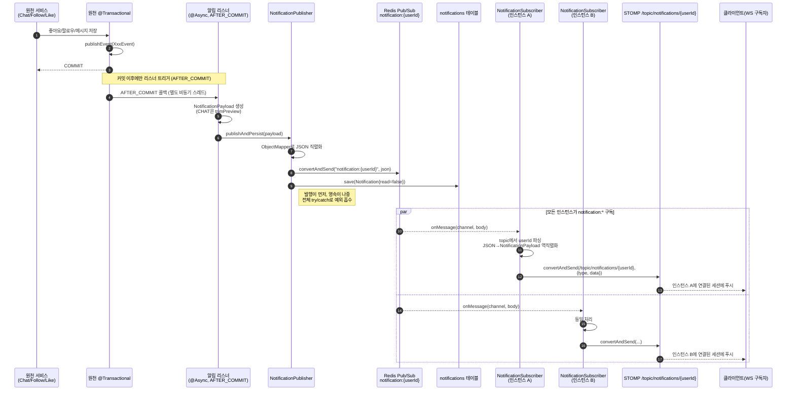

# 03. 알림(Notification) 도메인 상세 분석

> 대상: `src/main/java/com/example/HonBam/notification/**`, `config/RedisConfig.java`
> 기준 브랜치: `development` / Spring Boot 2.7
> 본 문서는 코드 분석 전용이며 코드 수정은 포함하지 않는다.

---

## 1. 개요

알림 도메인은 **서비스 도메인(채팅/피드)에서 발생한 사건을 사용자별 실시간 알림으로 변환·전달·영속화**하는 책임을 가진다. 핵심 설계는 다음과 같다.

- **이벤트 기반 디커플링**: 채팅/팔로우/좋아요 등 원천 도메인은 알림 로직을 직접 호출하지 않고 Spring `ApplicationEvent`만 발행한다. 알림 도메인의 리스너가 이를 구독한다.
- **트랜잭션 안전성**: 모든 알림 리스너는 `@TransactionalEventListener`(AFTER_COMMIT)로 동작하여, 원천 트랜잭션이 **커밋된 뒤에만** 알림을 생성한다(롤백 시 알림 미발생).
- **비동기 처리**: `@Async`로 알림 생성이 원천 요청 스레드를 블로킹하지 않는다.
- **멀티 인스턴스 Fan-out**: Redis Pub/Sub(`notification:{userId}`)로 발행하고, 모든 애플리케이션 인스턴스가 이를 수신하여 자신에게 연결된 WebSocket 세션(STOMP `/topic/notifications/{userId}`)으로 푸시한다.
- **영속화**: 발행과 동시에 `notifications` 테이블에 알림 레코드를 저장한다(읽음 여부 추적용).

### 처리하는 이벤트 종류

| 이벤트 클래스 | 발행 위치 | NotificationType | 카테고리 | 수신자 |
|---|---|---|---|---|
| `ChatMessageCreateEvent` | `chatapi/event/ChatMessageAsyncHandler.java:116` | `CHAT_MESSAGE` | CHAT | 채팅방 참여자(발신자 제외 대상 목록) |
| `FollowerCreatedEvent` | `snsapi/service/FollowService.java:49` | `FOLLOW` | FEED | 팔로우 당한 사용자(`followingId`) |
| `LikeCreateEvent` | `snsapi/service/LikeService.java:52` | `LIKE` | FEED | 게시글 작성자(`postAuthorId`) |

> `NotificationType`에는 `COMMENT`, `SYSTEM_ANNOUNCEMENT`도 선언되어 있으나, 본 도메인에서 이를 생성하는 리스너/발행 경로는 존재하지 않는다(미사용 enum 값).

---

## 2. 구성 요소

| 구분 | 파일 | 역할 |
|---|---|---|
| 엔티티 | `notification/entity/Notification.java` | 영속 알림 레코드. `receiverId`, `notificationType`(STRING), `read`/`readAt`, `payloadJson`(TEXT), `createdAt`. `markRead()` 도메인 메서드 보유 |
| 열거형 | `notification/entity/NotificationType.java` | 알림 타입 enum. 각 타입이 `NotificationCategory`를 보유(FOLLOW/LIKE/COMMENT→FEED, CHAT_MESSAGE→CHAT, SYSTEM_ANNOUNCEMENT→SYSTEM) |
| 열거형 | `notification/entity/NotificationCategory.java` | 상위 분류(FEED/CHAT/SYSTEM). `NotificationType` 내부에서만 사용, DB 미영속 |
| DTO | `notification/dto/NotificationPayload.java` | Redis 발행 및 WS 푸시 본문. `type`, `receiverId`, `senderId`, `postId`, `commentId`, `chatRoomUuId`, `chatMessageId`, `message`, `timestamp`, `meta`(확장 필드) |
| 이벤트 | `notification/event/ChatMessageCreateEvent.java` | 채팅 메시지 생성 이벤트. `of(ChatMessage, roomUuid, targetUserIds)` 팩토리 보유 |
| 이벤트 | `notification/event/FollowerCreatedEvent.java` | 팔로우 생성 이벤트(`followerId`, `followingId`) |
| 이벤트 | `notification/event/LikeCreateEvent.java` | 좋아요 생성 이벤트(`likeId`, `postId`, `postAuthorId`) |
| 리스너 | `notification/listener/ChatNotificationEventListener.java` | `ChatMessageCreateEvent` 수신 → 대상자별 `CHAT_MESSAGE` payload 생성 후 발행. 메시지 미리보기 트림(`trimPreview`) |
| 리스너 | `notification/listener/FeedNotificationEventListener.java` | `FollowerCreatedEvent`/`LikeCreateEvent` 수신 → `FOLLOW`/`LIKE` payload 생성 후 발행 |
| 서비스 | `notification/service/NotificationPublisher.java` | `publishAndPersist()` — payload를 JSON 직렬화 후 **Redis 발행 + DB 저장**을 한 메서드에서 수행 |
| 구독자 | `notification/subscriber/NotificationSubscriber.java` | Redis `notification:*` 수신 → `SimpMessagingTemplate`으로 `/topic/notifications/{userId}` STOMP 푸시(Redis→WS 브릿지) |
| 리포지토리 | `notification/repository/NotificationRepository.java` | `JpaRepository<Notification, Long>`. 수신자별 조회/미읽음 카운트/타입별 조회 쿼리 메서드 선언 |
| 설정 | `config/RedisConfig.java:67-88` | `notificationRedisTemplate`(String/String) 빈, `NotificationSubscriber`를 `PatternTopic("notification:*")`에 등록 |

---

## 3. API 엔드포인트

**REST 엔드포인트는 존재하지 않는다.**

- `notification` 패키지에 `@RestController`/`@Controller`가 없으며, 전 소스 트리에서도 알림 조회/읽음 처리 컨트롤러를 찾지 못했다.
- `NotificationRepository`에는 조회용 쿼리 메서드가 다수 선언되어 있으나(아래), **어떤 컨트롤러/서비스에서도 호출되지 않는다**(미사용 — `NotificationPublisher.save()`만 실제 사용).
  - `findTop50ByReceiverIdOrderByIdDesc`
  - `countByReceiverIdAndReadIsFalse`, `countByReceiverIdAndReadFalse`
  - `findByReceiverIdOrderByCreatedAtDesc`
  - `findByReceiverIdAndReadFalseOrderByCreatedAtDesc`
  - `findByReceiverIdAndNotificationType`
- 마찬가지로 엔티티의 `markRead()`를 호출하는 코드도 없어, **읽음 처리(read/readAt) 기능은 현재 미구현**이다.

따라서 현재 알림은 **실시간 WebSocket 푸시(쓰기 경로)만** 완성되어 있고, **조회/읽음 처리(읽기 경로)는 영속 데이터만 적재될 뿐 노출 API가 없다.**

실시간 수신 채널(엔드포인트 성격):
- STOMP 구독 destination: `/topic/notifications/{userId}` (클라이언트가 구독)

---

## 4. 데이터 흐름 (Redis → WebSocket 브릿지)

원천 도메인 트랜잭션 커밋 → (`@Async` + `@TransactionalEventListener`) 알림 리스너 → `NotificationPublisher.publishAndPersist`(Redis 발행 + DB 저장) → 모든 인스턴스의 `NotificationSubscriber` 수신 → 로컬 STOMP 세션으로 푸시.

핵심 포인트:
- **AFTER_COMMIT 보장**: 원천 트랜잭션이 롤백되면 이벤트 리스너가 호출되지 않으므로, "저장 안 된 사건에 대한 유령 알림"이 방지된다.
- **멀티 인스턴스 Fan-out**: 패턴 `notification:*` 구독은 모든 인스턴스에 동일하게 등록되므로, 발행 1건을 **모든 인스턴스가 수신**한다. 각 인스턴스는 자신에게 STOMP로 연결된 세션에만 푸시(in-memory SimpleBroker)하므로, 사용자가 어느 인스턴스에 붙어 있어도 알림이 도달한다.
- **채팅은 N건 발행**: 채팅 리스너는 `targetUserIds`를 순회하며 사용자마다 별도 payload를 발행한다(개인 채널 단위 fan-out).

---

## 5. 영속성

### Notification 엔티티 구조 (`notifications` 테이블)

| 컬럼 | 타입/매핑 | 비고 |
|---|---|---|
| `id` | `BIGINT`, `IDENTITY` | PK |
| `receiver_id` | `VARCHAR(36)`, not null | 수신자 사용자 ID(UUID 길이) |
| `notification_type` | `VARCHAR`(EnumType.STRING), not null | enum 이름 그대로 저장 |
| `is_read` | `BOOLEAN`, not null, 기본 `false`(`@Builder.Default`) | 읽음 여부 |
| `read_at` | `DATETIME`, nullable | `markRead()` 시점 기록(현재 호출처 없음) |
| `payload_json` | `TEXT`, not null | `NotificationPayload`의 직렬화 전문 |
| `created_at` | `DATETIME`, `@CreationTimestamp` | 생성 시각 |

인덱스:
- `idx_notification_receiver_created` (`receiver_id, created_at`) — 수신자별 최신순 조회 대비
- `idx_notification_receiver_read` (`receiver_id, is_read`) — 수신자별 미읽음 필터 대비

### 발행과 영속의 결합 방식

`NotificationPublisher.publishAndPersist`(L25-45)가 **단일 메서드에서 두 가지를 순차 수행**한다.

1. `objectMapper.writeValueAsString(payload)` — payload를 JSON 문자열로 직렬화(이 JSON이 Redis 본문이자 DB `payload_json`에 동일하게 저장됨).
2. `notificationRedisTemplate.convertAndSend(channel, json)` — **Redis 발행 먼저**.
3. `notificationRepository.save(...)` — **DB 저장 나중**.

특징:
- 발행과 영속이 **동일한 JSON 본문을 공유**하여 실시간/영속 데이터의 정합성을 맞춘다(같은 직렬화 결과 재사용).
- 메서드에 `@Transactional`이 **없다**. `save()`는 Spring Data의 자체 트랜잭션으로 처리되며, Redis 발행은 트랜잭션 대상이 아니다.
- 전체가 `try/catch(Exception)`으로 감싸져 있고 실패 시 `log.error`만 남기고 **예외를 흡수**한다(상위로 전파 없음).

---

## 6. 발견사항

각 항목은 코드 재확인 후 신뢰도(CONFIRMED/PLAUSIBLE)와 근거 `파일:라인`을 명시한다.

### F1. 발행이 영속보다 먼저 수행되어, DB 저장 실패 시 "푸시됐지만 미기록" 가능 — CONFIRMED
`NotificationPublisher.publishAndPersist`는 Redis `convertAndSend`(L30)를 먼저, `repository.save`(L39)를 나중에 호출한다. `save` 실패 시 이미 WebSocket 푸시가 나간 상태이고, 전체 `try/catch`(L26, L42)가 예외를 흡수하므로 **실시간 알림은 떴지만 DB에는 남지 않는** 비정합이 조용히 발생할 수 있다. 또한 메서드가 `@Transactional`이 아니어서 발행/영속이 하나의 원자 단위가 아니다.
- 근거: `notification/service/NotificationPublisher.java:25-45`

### F2. 멀티 인스턴스 Fan-out은 정확하나, "사용자별 채널"이라 중복 푸시는 없음 — CONFIRMED
`RedisConfig`가 모든 인스턴스에서 `PatternTopic("notification:*")`로 `NotificationSubscriber`를 등록(L86)하므로 발행 1건을 모든 인스턴스가 수신한다. 그러나 각 STOMP 세션은 단일 인스턴스에만 연결되고, 채널이 `notification:{userId}` 단위이므로 동일 사용자에게 **중복 전달은 발생하지 않는다**(연결된 인스턴스만 실제 세션 보유). 인스턴스 확장 시에도 도달성이 보장되는 올바른 fan-out 구조다. 단, SimpleBroker(in-memory) 전제이며 외부 STOMP 릴레이는 사용하지 않는다.
- 근거: `config/RedisConfig.java:86`, `notification/subscriber/NotificationSubscriber.java:24-37`

### F3. 채팅 미리보기 트림은 문자 길이 기준 단순 절단 — CONFIRMED
`trimPreview`는 `content.length() > 50`일 때 `substring(0,50) + "..."`로 절단한다(L51-56). 채팅 알림에만 적용되며 팔로우/좋아요 payload의 `message`는 항상 null이다. Java `length()`/`substring`은 UTF-16 코드유닛 기준이라 BMP 외 문자(이모지 서로게이트 페어)에서는 깨질 여지가 있으나 일반 텍스트에서는 문제없다.
- 근거: `notification/listener/ChatNotificationEventListener.java:43, 51-56`

### F4. 읽기 경로(조회/읽음 처리) 미구현 — CONFIRMED
알림용 REST 컨트롤러가 전무하고, `NotificationRepository`의 조회/카운트 메서드(L12-26)와 엔티티의 `markRead()`(`Notification.java:55`)를 호출하는 코드가 어디에도 없다. 즉 알림은 적재만 되고 사용자에게 목록/미읽음수를 노출하거나 읽음 처리할 API가 없다. 영속·인덱스 설계(`idx_notification_receiver_*`)는 향후 조회를 전제로 갖춰져 있다.
- 근거: `notification/repository/NotificationRepository.java:11-26`, `notification/entity/Notification.java:55-60` (호출처 없음, 전 소스 grep 결과 publisher 외 사용처 없음)

### F5. `LikeCreateEvent`의 `senderId`에 `likeId` 필드가 매핑되나 실제론 좋아요 누른 사용자 ID — PLAUSIBLE
`FeedNotificationEventListener.onLikeCreated`는 `payload.senderId(e.getLikeId())`로 설정한다(L47). `LikeService`에서 이벤트가 `new LikeCreateEvent(userId, postId, receivedId)`로 생성되므로(`LikeService.java:52`) `likeId` 자리에 들어가는 값은 사실 **좋아요를 누른 사용자 ID**다. 결과적으로 동작은 의도(senderId=좋아요 행위자)에 부합하나, 필드명 `likeId`가 실제 의미와 어긋나 가독성·유지보수 혼동을 유발한다. 또한 `postId`만 채우고 게시글 본문/썸네일 등 추가 컨텍스트는 payload에 없다.
- 근거: `notification/listener/FeedNotificationEventListener.java:43-52`, `notification/event/LikeCreateEvent.java:8-12`, `snsapi/service/LikeService.java:52`

### F6. 채팅 알림은 2단 비동기 이벤트 체인을 거친다 — CONFIRMED
채팅은 `ChatMessageSavedEvent` → `ChatMessageAsyncHandler`(`@Async("chatTaskExecutor")` + `@Transactional` + `@TransactionalEventListener(AFTER_COMMIT)`)가 `ChatMessageCreateEvent`를 재발행(L116) → `ChatNotificationEventListener`(`@Async` + `AFTER_COMMIT`)가 처리하는 구조다. 즉 알림 생성까지 비동기 단계가 둘이며, 두 번째 AFTER_COMMIT 리스너가 동작하려면 첫 핸들러의 `@Transactional` 경계가 커밋되어야 한다.
- 근거: `chatapi/event/ChatMessageAsyncHandler.java:40-42, 116-117`, `notification/listener/ChatNotificationEventListener.java:25-27`

### F7. 피드 리스너는 기본 phase(AFTER_COMMIT)에 의존하며 미사용 import 존재 — CONFIRMED
`FeedNotificationEventListener`의 두 메서드는 `@TransactionalEventListener`를 phase 명시 없이 사용한다(L28, L42). Spring 기본값이 `AFTER_COMMIT`이라 의도대로 동작하나, 채팅 리스너처럼 명시적이지 않아 가독성이 떨어진다. 또한 이 클래스는 `Notification`, `NotificationRepository`, `ObjectMapper`, `RedisTemplate` 등을 import하지만 실제로는 `NotificationPublisher`만 사용하는 **죽은 import**가 다수 있다.
- 근거: `notification/listener/FeedNotificationEventListener.java:4-16, 28, 42`

### F8. 비동기/직렬화 인프라 전제 — PLAUSIBLE
`@Async`가 동작하려면 `@EnableAsync`가 필요하며 `config/AsyncConfig.java`가 존재한다(grep 확인). `NotificationPayload`는 `timestamp`(LocalDateTime)를 포함하므로 `NotificationPublisher`/`NotificationSubscriber`가 주입받는 Spring 관리 `ObjectMapper`에 `jsr310`(JavaTimeModule)이 등록되어 있어야 직렬화/역직렬화가 성공한다(프로젝트 내 `JavaTimeModule` 사용 정황상 등록되어 있을 개연성 높음). 미등록 시 발행 단계에서 예외→`log.error`로 흡수되어 알림이 조용히 누락될 수 있다.
- 근거: `config/AsyncConfig.java`(존재), `notification/dto/NotificationPayload.java:26`, `notification/service/NotificationPublisher.java:18, 27`
