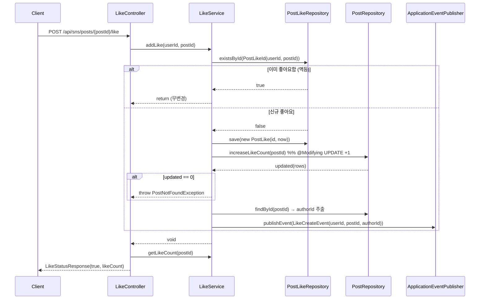

# SNS 도메인 상세 분석

> 대상: `src/main/java/com/example/HonBam/snsapi/`
> 프레임워크: Spring Boot 2.7 / Spring Data JPA / `javax.persistence`
> 기준 브랜치: `development`

---

## 1. 개요

SNS 도메인은 HonBam 서비스의 소셜 피드 기능을 담당하며, 책임 범위는 다음 4개의 하위 기능으로 나뉜다.

| 기능 | 책임 범위 | 핵심 클래스 |
| --- | --- | --- |
| **게시글(Post)** | 게시글 CRUD, 미디어(이미지) 첨부, 피드/탐색/내 게시물/유저별/오늘의 인증샷 조회, 비정규화 카운터(`likeCount`, `commentCount`) 보유 | `PostService`, `PostController` |
| **댓글(Comment)** | 댓글 CRUD, 1단계 대댓글(`parentId`), 게시글 `commentCount` 동기화 | `CommentService`, `SnsCommentController` |
| **좋아요(Like)** | 멱등 좋아요 등록/취소, 게시글 `likeCount` 원자 증감, 좋아요 알림 이벤트 발행 | `LikeService`, `LikeController` |
| **팔로우(Follow)** | 멱등 팔로우 등록/취소, 팔로워/팔로잉 수 실시간 집계, SNS 프로필 조회, 팔로우 알림 이벤트 발행 | `FollowService`, `FollowController` |

도메인 전반의 설계 특징:
- **User를 외래키 연관이 아닌 `String` ID(UUID, length=36)로 느슨하게 참조**한다. JPA 연관관계(`@ManyToOne User`)를 맺지 않고 `authorId`, `followerId`, `userId` 같은 문자열 컬럼만 보유한다.
- 좋아요/팔로우 관계는 **복합키(`@EmbeddedId`)** 로 모델링되어 중복 행을 DB 차원에서 방지한다.
- 게시글의 좋아요/댓글 수는 **비정규화 카운터**로 게시글 테이블에 저장하고, `@Modifying UPDATE` 로 원자 증감한다.
- 미디어는 별도 `upload` 도메인에서 presigned PUT으로 업로드된 뒤 `mediaId` 로만 참조되며, 조회 시 presigned GET URL을 생성한다.

---

## 2. 구성 요소

### 2.1 엔티티

| 엔티티 | 파일 경로 | 역할 |
| --- | --- | --- |
| `Post` | `snsapi/entity/Post.java` | 게시글. `authorId`(String 36), `content`(TEXT), 비정규화 `likeCount`/`commentCount`, `@CreationTimestamp`/`@UpdateTimestamp`, `postMedias`(1:N, cascade ALL, orphanRemoval, `@OrderBy("sortOrder ASC")`) |
| `Comment` | `snsapi/entity/Comment.java` | 댓글. `postId`, `authorId`(36), `content`(TEXT), `parentId`(대댓글용 nullable). `editContent()` 로 공백 검증 후 수정 |
| `Follow` | `snsapi/entity/Follow.java` | 팔로우 관계. `@EmbeddedId FollowId`, `createdAt`, `@PrePersist`로 생성 시각 보정 |
| `FollowId` | `snsapi/entity/FollowId.java` | 복합키 `(followerId, followingId)`, `Serializable` + `@EqualsAndHashCode` |
| `PostLike` | `snsapi/entity/PostLike.java` | 좋아요 관계. `@EmbeddedId PostLikeId`, `createdAt` |
| `PostLikeId` | `snsapi/entity/PostLikeId.java` | 복합키 `(userId, postId)`, `Serializable` + `@EqualsAndHashCode` |
| `PostMedia` | `snsapi/entity/PostMedia.java` | 게시글-미디어 연결. `@ManyToOne(LAZY) Post`, `@ManyToOne(LAZY) Media`, `sortOrder`, `@CreationTimestamp` |

### 2.2 리포지토리

| 리포지토리 | 파일 경로 | 역할 |
| --- | --- | --- |
| `PostRepository` | `snsapi/repository/PostRepository.java` | 2단계 조회용 ID 페이징 쿼리(`findPostIdsByAuthorId`, `findAllPostIdsOrderByCreatedAtDesc`, `findAllPostIdsOrderByLikeCountDesc`, `findTodayShotIds`), fetch join(`findAllWithMediaByIdIn`), 피드 서브쿼리(`findFeedPosts`), `@Modifying` 카운터 증감(`increase/decreaseCommentCount`, `increase/decreaseLikeCount`) |
| `CommentRepository` | `snsapi/repository/CommentRepository.java` | `findByPostIdOrderByCreatedAtAsc`, `findByPostIdAndParentIdOrderByCreatedAt`(대댓글), `findByIdAndPostId`, `countByPostId` |
| `FollowRepository` | `snsapi/repository/FollowRepository.java` | `existsById`/`deleteById`(복합키), 카운트(`countByIdFollowerId`, `countByIdFollowingId`), 목록(`findAllByIdFollowingId`, `findAllByIdFollowerId`) |
| `PostLikeRepository` | `snsapi/repository/PostLikeRepository.java` | `existsById`, 일괄 좋아요 조회(`findByUserIdAndPostIdIn`), `deleteByIdCustom`(@Modifying), `countByIdPostId` |

### 2.3 서비스

| 서비스 | 파일 경로 | 역할 |
| --- | --- | --- |
| `PostService` | `snsapi/service/PostService.java` | 게시글 등록/수정/삭제/상세, 피드·내 게시물·유저별·탐색·오늘의 인증샷 조회, 미디어 소유자 검증, 작성자/프로필/좋아요 일괄 조회 및 DTO 변환 |
| `CommentService` | `snsapi/service/CommentService.java` | 댓글 등록/수정/삭제, 댓글 트리(루트+대댓글) 구성, `commentCount` 동기화 |
| `FollowService` | `snsapi/service/FollowService.java` | 팔로우/언팔로우(멱등), 팔로우 여부·팔로워/팔로잉 수·목록, SNS 프로필 조립, 알림 이벤트 발행 |
| `LikeService` | `snsapi/service/LikeService.java` | 좋아요 등록/취소(멱등), `likeCount` 원자 증감, 좋아요 여부/수 조회, 알림 이벤트 발행 |

### 2.4 컨트롤러

| 컨트롤러 | 파일 경로 | base path | 역할 |
| --- | --- | --- | --- |
| `PostController` | `snsapi/api/PostController.java` | `api/sns/feed` | 게시글 CRUD + 피드/탐색/내 게시물/유저별/오늘의 인증샷 |
| `SnsCommentController` | `snsapi/api/SnsCommentController.java` | `/api/sns/posts/{postId}/comments` | 댓글 CRUD + 댓글/대댓글 목록 (Swagger `@Tag` 적용) |
| `LikeController` | `snsapi/api/LikeController.java` | `/api/sns/posts` | 좋아요 등록/취소/여부/수 |
| `FollowController` | `snsapi/api/FollowController.java` | `/api/sns/users` | 팔로우 등록/취소/여부 + 팔로워/팔로잉 목록 + SNS 프로필 |

### 2.5 주요 DTO

- 요청: `PostCreateRequestDTO`(content, mediaIds), `PostUpdateRequestDTO`, `CommentCreateRequestDTO`(content, parentId), `CommentUpdateRequestDTO`
- 응답: `PostResponseDTO`(liked 포함), `PostMediaResponseDTO`, `CommentResponseDTO`(재귀 `children`), `TodayShotResponseDTO`, `UserFollowResponseDTO`, `LikeStatusResponse`, `FollowStatusResponse`

---

## 3. API 엔드포인트

모든 엔드포인트는 `@AuthenticationPrincipal TokenUserInfo` 로 인증 사용자 ID를 주입받는다. 별도 표기가 없으면 **인증 필요**다.

### 3.1 PostController (`api/sns/feed`)

| 메서드 | 경로 | 인증 | 요약 |
| --- | --- | --- | --- |
| POST | `/api/sns/feed` | 필수 | 게시글 등록(`createPost`). `mediaIds`로 미디어 첨부, 소유자 검증 |
| GET | `/api/sns/feed/{postId}` | 필수 | 게시글 상세(`getPostDetail`), `liked` 포함 |
| GET | `/api/sns/feed/my` | 필수 | 내 게시물 목록(`getMyFeeds`), page/size |
| GET | `/api/sns/feed` | 필수 | 팔로잉 기반 피드(`getFeedPosts`), page/size |
| PUT | `/api/sns/feed/{postId}` | 필수 | 게시글 수정(`updatePost`), 작성자 검증 |
| GET | `/api/sns/feed/user/{authorId}` | 필수 | 특정 유저 게시물(`getUserPosts`) |
| GET | `/api/sns/feed/explore` | **선택**(null 허용) | 탐색 탭(`getExplorePosts`), `sort=popular|recent`. `userInfo==null` 허용(`userId=null`로 진행) |
| DELETE | `/api/sns/feed/{postId}` | 필수 | 게시글 삭제(`deletePost`), 작성자 검증 |
| GET | `/api/sns/feed/today-shots` | **불필요**(principal 미사용) | 당일 미디어 보유 게시글을 좋아요순으로(`getTodayShots`), limit |

### 3.2 SnsCommentController (`/api/sns/posts/{postId}/comments`)

| 메서드 | 경로 | 인증 | 요약 |
| --- | --- | --- | --- |
| POST | `.../comments` | 필수 | 댓글 등록(`createComment`). `parentId` 있으면 1단계 대댓글 |
| PUT | `.../comments/{commentId}` | 필수 | 댓글 수정(작성자만) |
| DELETE | `.../comments/{commentId}` | 필수 | 댓글 삭제(작성자만), `commentCount` 감소 |
| GET | `.../comments` | 필수(principal 미사용) | 댓글 트리(루트+children) 조회 |
| GET | `.../comments/replies/{parentId}` | 필수(principal 미사용) | 특정 댓글의 대댓글 목록 |

### 3.3 LikeController (`/api/sns/posts`)

| 메서드 | 경로 | 인증 | 요약 |
| --- | --- | --- | --- |
| POST | `/{postId}/like` | 필수 | 좋아요 등록(멱등). 응답 `LikeStatusResponse(liked=true, likeCount)` |
| DELETE | `/{postId}/like` | 필수 | 좋아요 취소(멱등). 응답 `LikeStatusResponse(liked=true, likeCount)` — *liked 값이 항상 true로 하드코딩됨* |
| GET | `/{postId}/like` | 필수 | 좋아요 여부 `{liked}` |
| GET | `/{postId}/like-count` | **불필요** | 좋아요 수 `{likeCount}` |

### 3.4 FollowController (`/api/sns/users`)

| 메서드 | 경로 | 인증 | 요약 |
| --- | --- | --- | --- |
| GET | `/{userId}/profile` | 필수 | SNS 프로필(`UserFollowResponseDTO`): 팔로워/팔로잉/게시물 수, following 여부 |
| POST | `/{targetId}/follow` | 필수 | 팔로우(멱등). 응답 `FollowStatusResponse(true, followerCount)` |
| DELETE | `/{targetId}/follow` | 필수 | 언팔로우(멱등). 응답 `FollowStatusResponse(false, followerCount)` |
| GET | `/{targetId}/follow` | 필수 | 팔로우 여부 `{following}` |
| GET | `/{targetId}/followers` | **불필요** | 팔로워 목록(`List<Follow>` 그대로 노출) |
| GET | `/{targetId}/following` | **불필요** | 팔로잉 목록(`List<Follow>` 그대로 노출) |

---

## 4. 데이터 흐름

### 4.1 게시글 작성 + 미디어 presigned 연결

미디어 업로드와 게시글 작성은 분리되어 있다. 클라이언트는 `upload` 도메인에서 presigned PUT URL을 발급받아 S3에 직접 업로드하고 `mediaId` 를 확보한 뒤, 그 ID 목록만 게시글 작성 요청에 담는다.

1. `POST /api/sns/feed` → `PostController.createPost` → `PostService.createPost` (`PostService.java:112`)
2. `Post` 빌더로 `likeCount=0, commentCount=0` 초기화 (`PostService.java:114-119`)
3. `mediaIds` 순회: 각 `mediaId`로 `Media` 조회 → **소유자 검증** `media.getUploaderId().equals(userId)` 실패 시 `CustomUnauthorizedException` (`PostService.java:129-131`) → `PostMedia.builder()`에 `sortOrder = order++` 부여 후 `post.addPostMedia(...)` (`PostService.java:133-139`)
4. `postRepository.save(post)` — `cascade=ALL` 로 `PostMedia` 동시 저장 (`Post.java:47`, `PostService.java:145`)
5. 작성자/프로필 조회 후 응답 조립. 미디어 응답 URL은 **저장된 fileKey로 presigned GET URL을 생성**(`buildPostMediaResponses` → `presignedUrlService.generatePresignedGetUrl`, `PostService.java:419-429`)

즉, presigned는 두 단계로 쓰인다: **업로드 시 PUT(upload 도메인)**, **조회/응답 시 GET(SNS 도메인)**. SNS 도메인이 직접 URL을 생성하는 부분은 모두 GET 용도다.

### 4.2 좋아요/팔로우 멱등 처리 + 비정규화 카운터 + 알림 이벤트 (Mermaid)

좋아요 등록 흐름(`LikeService.addLike`, `LikeService.java:28-54`):

핵심 포인트:
- **멱등성 경계**: `existsById` 로 선검사 후 신규일 때만 `save` + 카운터 증가. DB 복합 PK 제약이 최종 방어선이지만, 등록 경로는 트랜잭션 내 select-then-insert이므로 동시 요청 시 경합 여지가 있다.
- **비정규화 카운터**: 멤버 필드 직접 수정이 아니라 `@Modifying UPDATE ... SET like_count = like_count + 1` 로 DB에서 원자 증감 (`PostRepository.java:54-56`). 감소 쿼리는 `AND like_count > 0` 가드로 음수 방지 (`PostRepository.java:59`).
- **알림 이벤트**: `LikeCreateEvent`/`FollowerCreatedEvent` 를 `ApplicationEventPublisher` 로 발행해 notification 도메인이 비동기 처리.

팔로우(`FollowService.follow`, `FollowService.java:38-51`)도 동일하게 `existsById` → `save` 멱등 패턴을 쓰지만, **카운터를 저장하지 않고** `countByIdFollowingId`/`countByIdFollowerId` 로 매 요청 실시간 집계한다(4.x 발견사항 참조).

---

## 5. 영속성 / 연관관계

### 5.1 User를 ID 문자열로 느슨 참조
- `Post.authorId`, `Comment.authorId`, `FollowId.followerId/followingId`, `PostLikeId.userId` 는 모두 `@ManyToOne` 이 아니라 `String(length=36)` 컬럼이다. 따라서 SNS 엔티티 그래프에 `User` 가 포함되지 않으며, 닉네임/프로필은 서비스 계층에서 `userRepository.findAllById(...)` 로 별도 일괄 조회해 메모리에서 합친다(`PostService.convertToDTOList`, `PostService.java:255-308`).
- 장점: User 테이블과의 강결합/조인 회피. 단점: 작성자 삭제 시 정합성/표시 처리(코드상 `author == null` 시 로그 후 skip, `PostService.java:292-296`)를 애플리케이션이 책임진다.

### 5.2 복합키(@EmbeddedId)
- `Follow`–`FollowId(followerId, followingId)`, `PostLike`–`PostLikeId(userId, postId)` 는 `@EmbeddedId` + `Serializable` + `@EqualsAndHashCode` 로 구성된다. 동일 (사용자, 대상) 쌍의 중복 행을 PK 제약으로 차단해 좋아요/팔로우의 유일성을 보장한다.

### 5.3 비정규화 카운터 + @Modifying UPDATE 원자 증감
- `Post.likeCount`, `Post.commentCount` 를 테이블에 저장하고, 증감은 JPA 더티체킹이 아닌 `@Modifying` 벌크 UPDATE로 수행한다(`PostRepository.java:44-60`).
- 흥미롭게도 `Post` 엔티티에 `increaseCommentCount()/decreaseCommentCount()` 인스턴스 메서드도 존재하지만(`Post.java:66-74`), **실제 댓글 수 동기화는 `CommentService` 가 리포지토리 UPDATE 쿼리를 호출**해 처리한다(`CommentService.java:72`, `109`). 인스턴스 메서드는 사실상 미사용.
- 감소 쿼리는 모두 `AND p.xxxCount > 0` 가드 포함. `decreaseLikeCount` 만 `@Modifying(clearAutomatically = true, flushAutomatically = true)` 가 붙어 있고 나머지 3개 카운터 UPDATE에는 없다(비대칭).

### 5.4 2단계 조회(ID 페이징 → fetch join)로 N+1/페이징 충돌 회피
- 컬렉션 fetch join + 페이징을 동시에 쓰면 Hibernate가 전체를 메모리 페이징하는 문제를 피하기 위해, **1단계: ID만 페이징 조회**, **2단계: `WHERE id IN (...)` + `LEFT JOIN FETCH postMedias/media`** 로 본문을 가져온 뒤 **원래 ID 순서대로 메모리 재정렬**한다.
  - 적용: `getMyFeeds`(`PostService.java:56-79`), `getExplorePosts`(`:83-100`), `getTodayShots`(`:361-411`).
  - 재정렬: `findPostIdsByAuthorId` → `findAllWithMediaByIdIn`(`PostRepository.java:20-25`) → `postIds` 순서로 `map(postMap::get)`.
- 단, `getFeedPosts`(`findFeedPosts`, `PostRepository.java:36-41`)와 `getUserPosts`(`findByAuthorIdOrderByCreatedAtDesc`)는 이 2단계 패턴을 쓰지 않고 엔티티를 직접 조회한다. 이 경로들은 fetch join이 없어 DTO 변환 시 `postMedias`/`media` 지연 로딩으로 N+1 가능성이 있다(발견사항 참조).

### 5.5 대댓글 1단계 제한
- `Comment.parentId` 단일 컬럼으로 부모를 가리키며, `createComment` 에서 **부모 댓글이 이미 대댓글이면(`parent.getParentId() != null`) 예외**를 던져 depth를 1단계로 제한한다(`CommentService.java:48-55`).
- 조회 시 `getComments` 가 전체 댓글을 한 번에 읽어 `Map` 으로 루트/자식을 묶어 트리(`children`)를 구성한다(`CommentService.java:125-151`).

---

## 6. 발견사항

각 항목은 코드 재확인 후 신뢰도(CONFIRMED/PLAUSIBLE)와 근거 `파일:라인` 을 명시한다.

### 카운터 정합성

- **[CONFIRMED] `removeLike` 의 카운터 감소 결과를 검증하지 않음.** `addLike` 는 `increaseLikeCount` 반환값이 0이면 `PostNotFoundException` 을 던지지만(`LikeService.java:37-41`), `removeLike` 는 `int updated = postRepository.decreaseLikeCount(postId);` 의 반환값을 읽기만 하고 사용하지 않는다(`LikeService.java:68`). `likeCount==0` 가드(`PostRepository.java:59`)로 인해 실제 좋아요 행이 있어도 카운터가 0이면 감소가 누락될 수 있다(좋아요 행 삭제와 카운터 불일치 가능).
- **[CONFIRMED] 좋아요 등록 시 카운터 증가가 좋아요 행 존재와 별개로 동작.** `increaseLikeCount` 에는 `> 0` 같은 조건이 없어 항상 +1 한다(`PostRepository.java:55`). 멱등 선검사를 통과한 신규 건에서만 호출되므로 정상 흐름에서는 일치하지만, 카운터의 진실 원천이 좋아요 행 수(`countByIdPostId`)가 아니라 별도 누적값이라 드리프트(누적 오차) 가능성이 구조적으로 존재한다.
- **[CONFIRMED] 댓글 삭제 시 카운터 감소 실패가 삭제 자체를 롤백시킴.** `deleteComment` 는 `commentRepository.delete(comment)` 후 `decreaseCommentCount` 반환이 0이면 `IllegalArgumentException` 을 던진다(`CommentService.java:107-112`). 메서드가 `@Transactional` 이므로 이 예외는 댓글 삭제까지 함께 롤백한다. 즉 `commentCount` 가 이미 0인 비정상 상태에서는 정상 댓글조차 삭제 불가가 된다.
- **[CONFIRMED] 비정규화 UPDATE의 `clearAutomatically/flushAutomatically` 비대칭.** `decreaseLikeCount` 에만 두 옵션이 있고(`PostRepository.java:58`), `increaseLikeCount`/`increase·decreaseCommentCount` 에는 없다. 같은 트랜잭션에서 UPDATE 후 영속성 컨텍스트의 stale 엔티티를 다시 읽는 경우 카운터 값 불일치 가능. 응답에 쓰이는 `getLikeCount` 는 별도 쿼리(`findLikeCount`)라 직접 영향은 작지만 일관성 측면의 관찰 포인트.

### 멱등성 경계

- **[CONFIRMED] 팔로우 알림 이벤트가 멱등 경계 밖에서 발행됨.** `follow` 는 `if (!existsById) save(...)` 로 저장은 멱등이지만, `eventPublisher.publishEvent(new FollowerCreatedEvent(...))` 호출이 `if` 블록 밖에 있다(`FollowService.java:44-49`). 따라서 **이미 팔로우 중인 사용자가 다시 POST 하면 새 저장 없이도 알림 이벤트가 매번 발행**된다(좋아요는 반대로 신규일 때만 발행, `LikeService.java:31-52`).
- **[PLAUSIBLE] 멱등 선검사의 동시성 경합.** 좋아요/팔로우 모두 트랜잭션 내 `existsById` 후 `save` 하는 select-then-insert 패턴이라(`LikeService.java:31-35`, `FollowService.java:44-45`), 동시 중복 요청 시 복합 PK 유니크 위반으로 한쪽이 실패할 수 있다. DB 제약이 최종 방어선이라 데이터 무결성은 유지되나 예외 처리/카운터 보정은 코드상 부재.
- **[CONFIRMED] `removeLike`/`addLike` 응답의 `liked` 플래그 하드코딩.** 좋아요 취소 응답이 `new LikeStatusResponse(true, likeCount)` 로 등록과 동일하게 `liked=true` 를 반환한다(`LikeController.java:40`). 취소 직후 상태와 불일치.

### 페이징 패턴 관찰

- **[CONFIRMED] 2단계(ID 페이징→fetch join) 패턴이 일부 경로에만 적용.** `getMyFeeds`/`getExplorePosts`/`getTodayShots` 는 2단계 패턴(`PostService.java:60-78`, `87-99`, `368-381`)을 쓰지만, `getFeedPosts`(`PostService.java:104-107` → `findFeedPosts`, fetch join 없음)와 `getUserPosts`(`:233`)는 엔티티를 직접 페이징 조회한다. 후자는 DTO 변환 시 `postMedias`/`media` 지연 로딩으로 게시글 수만큼 추가 쿼리(N+1)가 발생할 수 있다.
- **[CONFIRMED] 댓글/대댓글 조회의 작성자 N+1.** `convertToCommentDTO` 가 댓글 하나마다 `userRepository.findById` + `userProfileMediaRepository.findByUser` 를 호출한다(`CommentService.java:159-166`). `getComments`/`getReplies` 가 댓글 리스트를 순회하며 매번 호출하므로 댓글 수에 비례한 N+1이 발생한다(게시글 목록의 일괄 조회 최적화와 대비됨).
- **[PLAUSIBLE] 탐색 탭에서 `viewerId == null` 경로.** `explore` 는 미인증 접근을 허용하여 `userId=null` 로 진행하는데(`PostController.java:96`), `convertToDTOList` 는 `postLikeRepository.findByUserIdAndPostIdIn(null, postIds)` 를 호출한다(`PostService.java:283-284`). 빈 결과로 동작할 가능성이 높으나, JPQL 파라미터에 `null` 이 들어가므로 좋아요 여부는 항상 false가 되며 의도된 동작인지 확인 필요.
- **[PLAUSIBLE] 카운트/총 페이지 메타데이터 미사용.** ID 조회가 `Page<Long>` 을 반환하지만 서비스는 `getContent()` 만 사용하고 응답은 `List` 다(`PostService.java:60-61`, `PostController` 의 모든 목록 반환). 클라이언트가 총 개수/다음 페이지 유무를 받을 수 없어 무한스크롤 종료 판단을 size 비교에 의존해야 한다.

### 기타 관찰

- **[CONFIRMED] `LikeCreateEvent` 필드명 의미 불일치(혼동 소지).** `LikeService` 는 `new LikeCreateEvent(userId, postId, receivedId)` 로 발행하지만(`LikeService.java:52`), 이벤트의 첫 필드명은 `likeId` 다(`notification/event/LikeCreateEvent.java:9`). 실제로는 "좋아요 누른 사용자 ID"가 `likeId` 자리에 매핑되어 명명이 오해를 부른다(동작은 위치 기반 생성자라 정상).
- **[CONFIRMED] 팔로워/팔로잉 목록 엔드포인트가 엔티티를 그대로 노출하고 인증을 요구하지 않음.** `getFollowers`/`getFollowing` 은 `List<Follow>`(복합키 엔티티)를 응답으로 반환하며 `@AuthenticationPrincipal` 없이 `targetId` 만 받는다(`FollowController.java:75-84`). DTO 미변환.
- **[CONFIRMED] `createPost`/`updatePost` 에서 미사용 조회 존재.** `createComment`/`updateComment` 의 `User user = userRepository.findById(...)` 결과가 변수로만 받고 사용되지 않는 경우가 있다(`CommentService.java:59-60`, `86-87` 의 `user`는 권한 검증에 직접 쓰이지 않음). 불필요한 쿼리 1회.
