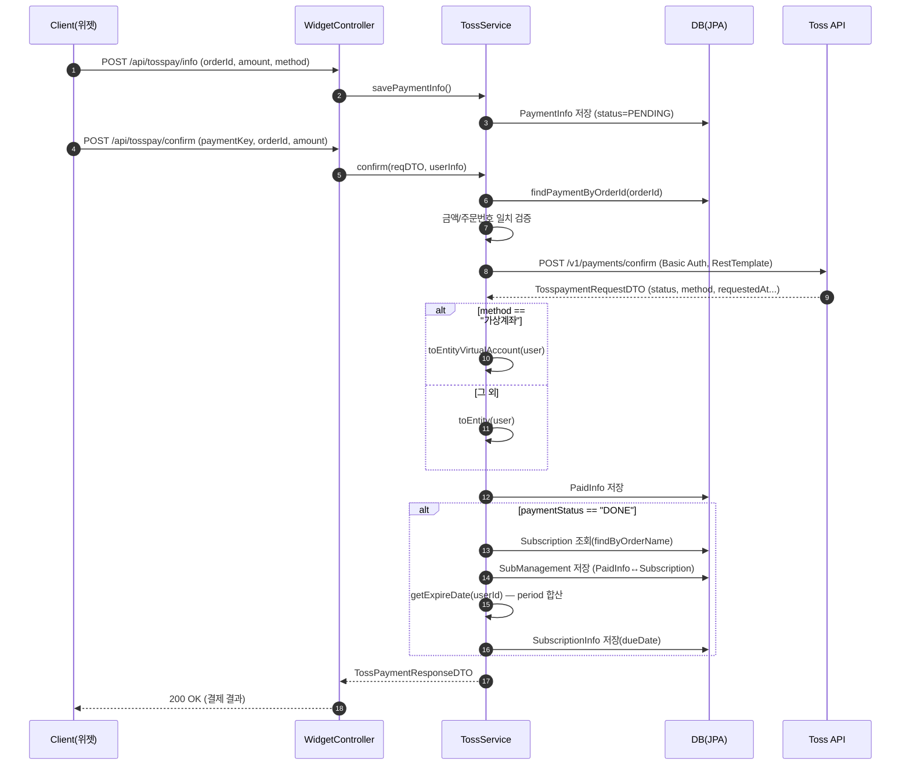

# 07. 결제 / 구독 도메인 (Toss Payments) 분석

> 대상 패키지: `com.example.HonBam.paymentsapi` (api, dto, entity, repository, service)
> 관련 설정/유틸: `config/TossPaymentsConfig.java`, `util/SubscriptionService.java`, `util/SubscriptionScheduler.java`
> 기준 브랜치: `development`

---

## 1. 개요

HonBam의 결제 도메인은 **Toss Payments 결제위젯(Widget)** 연동을 통해 구독권(정기 이용권) 결제를 처리한다. 주요 책임은 다음과 같다.

- **결제 승인(confirm)**: 프런트에서 위젯 결제 후 전달받은 `paymentKey / orderId / amount` 로 Toss 승인 API를 호출하고, 승인 성공 시 결제 내역(`PaidInfo`)을 저장한다.
- **결제 취소(cancel)**: `paymentKey` 기반으로 Toss 취소 API를 호출하여 환불을 처리한다.
- **가상계좌 분기**: 결제 수단이 `가상계좌`인 경우 입금 은행/계좌번호/예금주 정보를 별도로 매핑한다.
- **구독 관리**: 결제 성공 시 구독권(`Subscription`)과 결제(`PaidInfo`)를 `SubManagement`로 연결하고, 사용자별 구독 만료일(`SubscriptionInfo.dueDate`)을 계산·저장한다.
- **구독 만료 스케줄러**: `@Scheduled`로 만료 대상 구독을 주기적으로 조회한다(현재 실제 상태 변경 로직은 주석 처리되어 동작하지 않음, 6장 참고).

모든 Toss API 인증은 시크릿 키를 Base64 인코딩한 **HTTP Basic** 방식을 사용한다.

---

## 2. 구성 요소

### 2.1 엔티티

| 엔티티 | 파일 | 역할 |
|---|---|---|
| `PaymentInfo` | `paymentsapi/entity/PaymentInfo.java` | 승인 **요청 전** 임시 주문 정보(주문번호·금액·수단). `paymentStatus`(enum, 기본 `PENDING`), `create_at` 보유. 테이블 `payment_info` |
| `PaidInfo` | `paymentsapi/entity/PaidInfo.java` | 승인/취소 **완료된** 실제 결제 내역. 금액·주문명·결제키·요청시각·결제상태(`String`)·은행/계좌(가상계좌). `User`와 `@ManyToOne`. 테이블 `paid_info` |
| `Subscription` | `paymentsapi/entity/Subscription.java` | 판매 중인 구독권 상품(기간 `period`, 가격 `price`, `orderName`, 설명). 테이블 `hb_subscription` |
| `SubManagement` | `paymentsapi/entity/SubManagement.java` | `PaidInfo` ↔ `Subscription` 연결(중간) 엔티티. 둘 다 `@ManyToOne(LAZY)`. 테이블 `sub_management` |
| `SubscriptionInfo` | `paymentsapi/entity/SubscriptionInfo.java` | 사용자별 구독 만료일(`dueDate`) 보유. `User`와 `@OneToOne(LAZY)`. 테이블 `subscription_info` |
| `PaymentStatus` (enum) | `paymentsapi/entity/PaymentStatus.java` | `PENDING / COMPLETED / CANCELED`. `PaymentInfo`에서만 사용 |

> 참고: `SubscriptionStatus` 라는 별도 enum 파일은 존재하지 않는다. 구독 상태는 사용자 엔티티 측 `UserPay`(NORMAL 등)로 추정되며, `PaidInfo.paymentStatus`는 enum이 아닌 **문자열**(Toss 응답의 `"DONE"`, `"CANCELED"` 등)을 그대로 저장한다.

### 2.2 리포지토리

| 리포지토리 | 파일 | 주요 메서드 |
|---|---|---|
| `PaymentInfoRepository` | `paymentsapi/repository/PaymentInfoRepository.java` | `findByOrderId`, `findPaymentByOrderId`(JPQL) |
| `PaidInfoRepository` | `paymentsapi/repository/PaidInfoRepository.java` | `findByOrderId`, `updatePaymentStatus`(native `@Modifying`, 미사용) |
| `SubscriptionRepository` | `paymentsapi/repository/SubscriptionRepository.java` | `findAll`, `findByOrderName` |
| `SubManagementRepository` | `paymentsapi/repository/SubManagementRepository.java` | `findByUserIdWithFetchJoin`(paidInfo·subscription·user fetch join) |
| `SubscriptionInfoRepository` | `paymentsapi/repository/SubscriptionInfoRepository.java` | `findByUserId`, `findExpireDate`(dueDate < targetDate) |

### 2.3 서비스 / 컨트롤러 / 설정 / 스케줄러

| 구성 요소 | 파일 | 역할 |
|---|---|---|
| `TossService` | `paymentsapi/service/TossService.java` | 핵심 비즈니스 로직. 결제정보 저장·승인·취소·주문조회·만료일 계산. `@Transactional` |
| `WidgetController` | `paymentsapi/api/WidgetController.java` | `/api/tosspay` REST 엔드포인트. 구독목록/결제정보/승인/취소/주문조회 + success·fail·index 뷰 라우팅 |
| `TossPaymentsConfig` | `config/TossPaymentsConfig.java` | `@Value`로 클라이언트키·시크릿키·success/fail URL 주입. Toss URL 상수 보유 |
| `SubscriptionService` | `util/SubscriptionService.java` | 만료 구독 조회 후 후처리(현재 실제 변경 로직 주석 처리됨) |
| `SubscriptionScheduler` | `util/SubscriptionScheduler.java` | `@Scheduled(fixedDelay = 100000000)`로 `updateSubscriptions2()` 주기 호출 |

### 2.4 DTO

| DTO | 파일 | 방향 | 비고 |
|---|---|---|---|
| `PaymentInfoRequestDTO` | `dto/request/PaymentInfoRequestDTO.java` | 요청 | `/info` 임시 주문정보 → `PaymentInfo` 변환 |
| `PaymentConfirmReqDTO` | `dto/request/PaymentConfirmReqDTO.java` | 요청 | confirm/cancel 공용(orderId, amount, paymentKey, method) |
| `TosspaymentRequestDTO` | `dto/request/TosspaymentRequestDTO.java` | Toss 응답 매핑 | `@JsonProperty`로 `totalAmount→amount`, `status→paymentStatus`. `VirtualAccount` 내부클래스. `toEntity`/`toEntityVirtualAccount` |
| `SubManagementReqDTO` | `dto/request/SubManagementReqDTO.java` | 내부 | `toEntity(subscription, paidInfo)` |
| `TossPaymentResponseDTO` | `dto/response/TossPaymentResponseDTO.java` | 응답 | `PaidInfo` → 클라이언트 응답 |
| `OrderInfoResponseDTO` | `dto/response/OrderInfoResponseDTO.java` | 응답 | **빈 클래스**(미사용) |

---

## 3. API 엔드포인트

베이스 경로: **`/api/tosspay`** (`WidgetController`)

| 메서드 | 경로 | 인증(`@AuthenticationPrincipal`) | 요약 |
|---|---|---|---|
| `GET` | `/subscription` | 불필요 | 판매 중인 구독권 전체 목록 조회(`subscriptionRepository.findAll()`) |
| `POST` | `/info` | 필요(`TokenUserInfo`) | 승인 전 임시 주문정보(`PaymentInfo`) 저장. 본문 `PaymentInfoRequestDTO` |
| `POST` | `/confirm` | 필요 | Toss 결제 **승인** 요청 → `PaidInfo` 저장 → 구독 만료일 갱신. 본문 `PaymentConfirmReqDTO` |
| `POST` | `/cancel` | 필요 | Toss 결제 **취소/환불**. 본문 `PaymentConfirmReqDTO` |
| `POST` | `/order/{orderKey}` | 필요(미사용) | `orderKey`로 Toss 주문 조회(`getOrderInfoByOrderId`) |
| `GET` | `/success` | - | 결제 성공 리다이렉트 뷰(`/success`) |
| `GET` | `/` | - | 체크아웃 인덱스 뷰(`/checkout`) |
| `GET` | `/fail` | - | 실패 리다이렉트 뷰. `code`/`message` 파라미터를 모델에 담아 `/fail` 반환 |

> 비고: `WidgetController`는 `@RestController`이므로 `/success`, `/`, `/fail`의 `String` 반환값은 **뷰 이름이 아니라 응답 본문 문자열**로 그대로 직렬화된다(`WidgetController.java:82-100`, 6장 PLAUSIBLE 참고).

---

## 4. 데이터 흐름

### 4.1 결제 승인(confirm) 흐름

1. **(사전) 임시 주문 저장** — `POST /info` → `savePaymentInfo()`
   - `findByOrderId`로 기존 주문 존재 여부 확인, 있으면 `payId` 재사용(업서트).
   - `PaymentInfo` 저장(상태는 항상 기본값 `PENDING`).
   - 위치: `TossService.java:58-67`.

2. **승인 요청** — `POST /confirm` → `confirm()` (`TossService.java:70-112`)
   - 시크릿 키를 Base64 Basic 인코딩(`getEncodedKey`, line 201-203).
   - `findPaymentByOrderId`로 임시 주문 조회 후 **금액·주문번호 일치 검증**(line 79-81). 불일치 시 `IllegalArgumentException`.
   - `getMapResponseEntity()`(line 148-166)에서 **RestTemplate**으로 Toss `…/payments/confirm` POST 호출 → `TosspaymentRequestDTO` 수신.
   - 결제수단이 `"가상계좌"`면 `toEntityVirtualAccount(user)`, 아니면 `toEntity(user)`로 `PaidInfo` 변환 후 저장(line 86-92).

3. **구독 연결 및 만료일 설정** — 저장된 `PaidInfo.paymentStatus == "DONE"`일 때만(line 94)
   - `findByOrderName`으로 결제된 구독권 조회(없으면 `SubscriptionNotFoundException`).
   - `SubManagement`(PaidInfo↔Subscription)를 저장(line 98).
   - `getExpireDate(userId)`(line 209-223): 사용자의 모든 `SubManagement`를 fetch join으로 조회해 **구독 기간(period) 합산**, **가장 이른 결제시각(requestedAt)** 기준 + `plusDays(period)`로 만료일 계산.
   - `SubscriptionInfo` 업서트 저장(`subInfoId` 존재 시 갱신, `dueDate` 설정, line 100-109).

4. 응답으로 `TossPaymentResponseDTO(save)` 반환.



### 4.2 가상계좌 분기

- Toss 응답 `method == "가상계좌"`인 경우 `TosspaymentRequestDTO.virtualAccount`(예금주·`bankCode→bank`·계좌번호)를 `PaidInfo`에 매핑(`TosspaymentRequestDTO.java:56-70`).
- 가상계좌는 **입금 전 상태**에서는 `paymentStatus`가 `"DONE"`이 아닐 수 있으므로(예: `WAITING_FOR_DEPOSIT`), 4.1의 구독 연결 블록은 건너뛴다(line 94 조건). 실제 입금 완료(webhook) 처리 코드는 본 도메인에 존재하지 않음(6장 관찰).

### 4.3 결제 취소(cancel) 흐름

- `POST /cancel` → `cancel()` (`TossService.java:168-199`)
  - `findByOrderId`로 기존 `PaidInfo` 조회(없으면 `OrderNotFoundException`).
  - **WebClient**로 Toss `…/payments/{paymentKey}/cancel` POST 호출(`cancelReason="단순 변심"` 고정).
  - 응답 DTO를 `toEntity(user, paidInfo.getPaidId())`로 변환 후 저장(6장의 PLAUSIBLE 버그 참고: `paidId`가 실제로 세팅되지 않음).

---

## 5. 영속성 (엔티티 관계 / 상태)

### 5.1 관계도

```
User 1 ──< (ManyToOne) PaidInfo
User 1 ── (OneToOne)   SubscriptionInfo   (dueDate: 만료일)

PaidInfo 1 ──< SubManagement >── 1 Subscription
              (sub_management 중간 테이블)
              paid_id           sub_id
```

- `SubManagement`가 결제 1건(`PaidInfo`)과 구독권(`Subscription`)을 N:M 형태로 매개(둘 다 `@ManyToOne(LAZY)`).
- `SubscriptionInfo`는 사용자당 1행(`@OneToOne`)으로 누적 만료일을 보관. `confirm()`에서 기존 행이 있으면 `subInfoId`를 재사용해 갱신(업서트).
- `PaidInfo.paymentStatus`는 `String`(Toss 원문), `PaymentInfo.paymentStatus`는 `PaymentStatus` enum.

### 5.2 PaymentStatus enum 상태 전이

```
PENDING ──(승인 성공)──> COMPLETED
PENDING ──(취소)───────> CANCELED
```

> 다만 **코드상 위 전이는 실제로 일어나지 않는다.** `PaymentInfo`는 생성 시 항상 `PENDING`으로 저장되며, `COMPLETED`/`CANCELED`로 갱신하는 로직이 없다(6장 CONFIRMED). 결제 성공/취소 판별은 `PaidInfo.paymentStatus`의 문자열(`"DONE"`, `"CANCELED"`)로만 이루어진다.

---

## 6. 발견사항

> 표기: `CONFIRMED` = 코드로 명확히 확인됨 / `PLAUSIBLE` = 정황상 버그·이슈로 추정(런타임 미검증).

### ① WebClient와 RestTemplate 혼용 — CONFIRMED
- `confirm()`의 승인 호출만 **RestTemplate**(`HttpEntity`/`HttpHeaders`)을 사용: `TossService.java:148-166` (`new RestTemplate()`, `restTemplate.exchange(...)`).
- 취소·주문조회는 **WebClient**(`block()`)를 사용: `cancel()` `TossService.java:186-193`, `getOrderInfoByOrderId()` `:117-123`, `getOrderInfo()` `:134-140`.
- 두 HTTP 클라이언트가 한 서비스에 혼재하며, 모두 메서드 내부에서 매번 `new`로 생성(빈 재사용/커넥션 풀 공유 없음). 일관성·자원 측면 개선 여지.

### ② 시크릿 키 Base64 Basic 인증 — CONFIRMED
- `getEncodedKey()` (`TossService.java:201-203`): `"Basic " + Base64.encode((secretKey + ":"))`. Toss 규격(시크릿키 뒤 `:` 추가 후 Base64)을 정확히 따름.
- 시크릿 키는 `TossPaymentsConfig`에서 `@Value("${payment.toss.test_secret_api_key}")`로 주입(`config/TossPaymentsConfig.java:15-16`) — **테스트 키** 프로퍼티명 사용. 운영 키 분리 설정은 코드상 없음.

### ③ 결제-구독 상태 정합성 / 예외 처리 관찰
- **PaymentInfo 상태 미전이 — CONFIRMED**: `PaymentInfo.paymentStatus`는 항상 `PENDING`으로만 저장되고 갱신 로직이 없음(`PaymentInfo.java:33-36`, `PaymentInfoRequestDTO.toEntity`는 status를 세팅하지 않음). enum의 `COMPLETED`/`CANCELED`는 사용되지 않는 사실상 dead 값.
- **취소 시 `paidId` 미설정으로 신규 INSERT 우려 — PLAUSIBLE**: `cancel()`은 `requestDTO.toEntity(user, paidInfo.getPaidId())`(`TossService.java:195`)를 호출하지만, 해당 `toEntity(User, Long)`는 **`payId`/`paidId`를 빌더에 넣지 않음**(`TosspaymentRequestDTO.java:88-100`). 따라서 기존 결제 행을 `CANCELED`로 갱신하는 대신 새 `PaidInfo` 행이 INSERT될 가능성이 높음.
- **만료일 계산 로직 — PLAUSIBLE**: `getExpireDate()`(`TossService.java:209-223`)는 사용자의 전체 `SubManagement`의 `period`를 합산하고 **가장 이른** 결제시각을 기준으로 `plusDays`한다. 누적 결제마다 기준 시각이 과거로 고정되어, 의도(최근 결제 기준 연장)와 다를 수 있음. `paidDate`가 null이면 `Objects.requireNonNull`로 NPE 발생.
- **주문 조회 URI/값 불일치 — PLAUSIBLE**: `getOrderInfo()`의 `requestURI`는 `…/payments/{paymentKey}` 템플릿이지만 실제로는 `orderKey`(주문번호)를 바인딩(`TossService.java:132-140`). paymentKey 엔드포인트에 orderId를 넣어 호출하는 불일치.
- **PaidInfoRepository 네이티브 쿼리 문법 오류 — PLAUSIBLE(미사용)**: `updatePaymentStatus`의 `SET (col = :a, col = :b)` 구문은 표준 SQL `UPDATE`로 유효하지 않음(`PaidInfoRepository.java:18-20`). 현재 호출처가 없어 영향은 없음.
- **컨트롤러 예외 처리 일관성 — CONFIRMED**: `/confirm`은 `JsonProcessingException`을 `internalServerError`로 변환(`WidgetController.java:53-55`)하지만, `/cancel`은 모든 예외를 `throw new RuntimeException(e)`로 재던짐(`:65-67`), `/order`는 호출 뒤 무의미한 try-catch(예외 발생 지점이 try 밖, `:74-79`). 처리 방식이 제각각.
- **`@RestController`에서 뷰 문자열 반환 — PLAUSIBLE**: `/success`·`/`·`/fail`이 `"/success"` 등 문자열을 반환하나 `@RestController`이므로 뷰 렌더링이 아닌 응답 본문으로 출력됨(`WidgetController.java:82-100`).

### ④ 구독 만료 스케줄러 사실상 비동작 — CONFIRMED
- `SubscriptionScheduler`(`util/SubscriptionScheduler.java:15-19`): `@Scheduled(fixedDelay = 100000000)`(약 27.7시간 간격)로 `updateSubscriptions2()` 호출.
- `SubscriptionService.updateSubscriptions2()`(`util/SubscriptionService.java:47-63`): 만료 기준 시각이 `"2026-02-07 19:45:23"`로 **하드코딩**되어 있고, 실제 구독 해지(`UserPay.NORMAL` 변경·저장) 및 알림 코드는 **전부 주석 처리**됨. 즉 조회 후 로그만 남기고 상태 변경은 일어나지 않음.

---

## 부록 A. 핵심 파일 인덱스

- 서비스: `src/main/java/com/example/HonBam/paymentsapi/service/TossService.java`
- 컨트롤러: `src/main/java/com/example/HonBam/paymentsapi/api/WidgetController.java`
- 설정: `src/main/java/com/example/HonBam/config/TossPaymentsConfig.java`
- 스케줄러/유틸: `src/main/java/com/example/HonBam/util/SubscriptionScheduler.java`, `.../util/SubscriptionService.java`
- 엔티티: `paymentsapi/entity/{PaymentInfo,PaidInfo,Subscription,SubManagement,SubscriptionInfo,PaymentStatus}.java`
- 리포지토리: `paymentsapi/repository/{PaymentInfo,PaidInfo,Subscription,SubManagement,SubscriptionInfo}Repository.java`
- DTO: `paymentsapi/dto/request/*`, `paymentsapi/dto/response/*`
