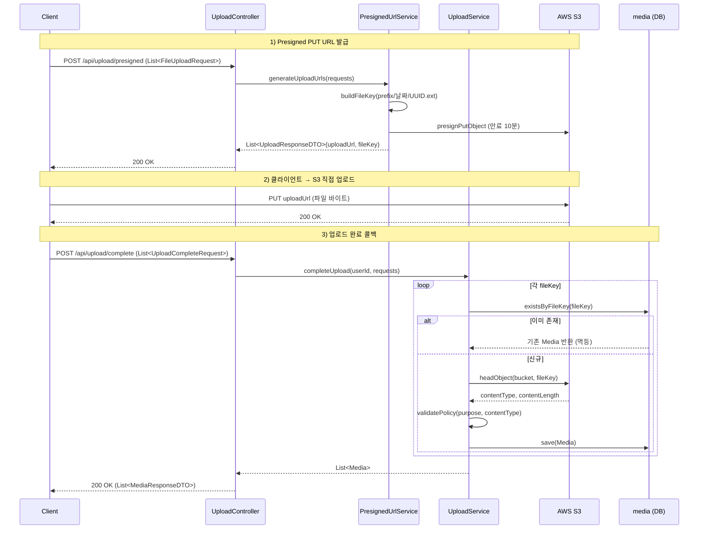

# 08. 미디어 업로드(Upload/Media) 도메인 분석

> 분석 대상: `src/main/java/com/example/HonBam/upload/` 전체, `config/S3Config.java`, `config/WebConfig.java`, `build.gradle`
> 기준: Spring Boot 2.7.17 / Java 11 / AWS SDK for Java v2 (S3)

---

## 1. 개요

미디어 업로드 도메인은 **S3 Presigned URL 기반의 클라이언트 직접 업로드(direct upload)** 패턴을 사용한다. 서버는 파일 바이트를 직접 받지 않고, 다음 두 단계로만 관여한다.

1. **Presigned URL 발급**: 클라이언트가 업로드할 파일 메타데이터(파일명/Content-Type/용도)를 보내면, 서버는 S3에 PUT 가능한 서명 URL과 객체 키(`fileKey`)를 발급한다.
2. **업로드 완료 콜백(complete)**: 클라이언트가 S3로 직접 PUT을 끝낸 뒤 서버에 `fileKey` 목록을 통보하면, 서버는 S3 `headObject`로 실제 존재/메타데이터를 검증하고 정책 검증을 거쳐 `Media` 엔티티로 영속화한다.

미디어는 용도(`MediaPurpose`)에 따라 **PROFILE / POST / CHAT** 세 가지로 구분되며, 용도별로 S3 키 prefix와 Content-Type 정책이 달라진다. 업로드된 파일은 `Media` 엔티티 한 테이블(`media`)로 통합 관리되고, `fileKey` 유니크 제약을 이용한 멱등 저장과 `deletedAt` 기반 소프트 삭제 필드를 갖는다.

> 참고: `config/WebConfig.java`의 `/uploads/**` 정적 리소스 매핑(로컬 파일시스템 서빙)은 본 S3 업로드 흐름과는 **별개의 레거시/로컬 경로**이다(아래 6장 참조).

---

## 2. 구성 요소

| 구성 요소 | 파일 경로 | 역할 |
|---|---|---|
| `Media` (엔티티) | `upload/entity/Media.java` | 업로드된 미디어 메타데이터 영속화 엔티티. `uploaderId`, `mediaPurpose`, `fileKey`(unique), `contentType`, `fileSize`, `createdAt`, `deletedAt` 보유 |
| `MediaPurpose` (enum) | `upload/entity/MediaPurpose.java` | 미디어 용도 + S3 키 prefix 정의(`PROFILE→profile`, `POST→post`, `CHAT→chat`) |
| `MediaRepository` | `upload/repository/MediaRepository.java` | `JpaRepository<Media, Long>`. `findByFileKey`, `existsByFileKey` 제공(멱등 처리용) |
| `PresignedUrlService` | `upload/service/PresignedUrlService.java` | S3 `S3Presigner`로 PUT/GET presigned URL 생성, `fileKey` 빌드 |
| `UploadService` | `upload/service/UploadService.java` | 업로드 완료 처리: `headObject` 검증 → 정책 검증 → `Media` 저장 |
| `UploadController` | `upload/api/UploadController.java` | `/api/upload` REST 엔드포인트(presigned 발급 / 완료 콜백) |
| `S3Config` | `config/S3Config.java` | `S3Client`, `S3Presigner` Bean 구성(정적 자격증명, region) |
| `FileUploadRequest` (DTO) | `upload/dto/FileUploadRequest.java` | presigned 다건 요청: `fileName`, `contentType`, `mediaPurpose` |
| `JoinUploadRequest` (DTO) | `upload/dto/JoinUploadRequest.java` | 프로필 presigned 요청: `fileName`, `contentType` (purpose 고정) |
| `UploadCompleteRequest` (DTO) | `upload/dto/UploadCompleteRequest.java` | 완료 콜백 요청: `fileKey`, `purpose` |
| `UploadResponseDTO` (DTO) | `upload/dto/UploadResponseDTO.java` | presigned 응답: `uploadUrl`, `fileKey`, `fileName`, `purpose` |
| `MediaResponseDTO` (DTO) | `upload/dto/MediaResponseDTO.java` | 완료 응답: `mediaId`, `fileKey`, `contentType`, `fileSize` |

---

## 3. API 엔드포인트

기본 경로: `@RequestMapping("/api/upload")` (`UploadController.java:19`)

| 메서드 | 경로 | 인증 | 요청 | 응답 | 요약 |
|---|---|---|---|---|---|
| `POST` | `/api/upload/presigned/profile` | **permitAll** (회원가입 시 사용) | `JoinUploadRequest` (단건) | `UploadResponseDTO` | 프로필 이미지용 PUT presigned URL 발급. image/* 만 허용, 만료 3분 |
| `POST` | `/api/upload/presigned` | **authenticated** | `List<FileUploadRequest>` | `List<UploadResponseDTO>` | 게시글/채팅 등 다건 PUT presigned URL 발급. 만료 10분, GET URL(60분)도 함께 생성 |
| `POST` | `/api/upload/complete` | **authenticated** | `List<UploadCompleteRequest>` | `List<MediaResponseDTO>` | 업로드 완료 통보. S3 존재/메타 검증 후 `Media` 다건 저장 |

인증 정책 근거(`config/WebSecurityConfig.java`):
- `/api/upload/presigned/profile` → `permitAll()` (`WebSecurityConfig.java:91`) — 회원가입 단계에서 토큰 없이 호출 가능하도록 개방
- `/api/upload/**` → `authenticated()` (`WebSecurityConfig.java:97`) — 위 1건을 제외한 나머지 업로드 요청은 인증 필요
- `/uploads/**` (GET) → `permitAll()` (`WebSecurityConfig.java:86`) — 로컬 정적 파일 서빙용(별개 경로)

> 참고: `/presigned`, `/complete` 핸들러는 `@AuthenticationPrincipal TokenUserInfo userInfo`를 받는다. `/complete`는 `userInfo.getUserId()`를 `uploaderId`로 사용하지만(`UploadController.java:50`), `/presigned`는 `userInfo`를 파라미터로 선언만 하고 실제로는 사용하지 않는다(`UploadController.java:37`).

---

## 4. 데이터 흐름

### (a) Presigned PUT URL 발급

#### 프로필용 — `generateProfileUploadUrl` (`PresignedUrlService.java:94`)
1. `contentType`이 `image/`로 시작하지 않으면 `IllegalArgumentException`("프로필은 이미지 파일만 허용됩니다.")로 즉시 거부 (`PresignedUrlService.java:95-97`)
2. `buildFileKey("profile", fileName)`로 객체 키 생성 (`PresignedUrlService.java:99`)
3. `PutObjectRequest`(bucket/key/contentType) + `PutObjectPresignRequest`(만료 **3분**)로 서명 (`PresignedUrlService.java:109`)
4. 응답에 `uploadUrl`, `fileKey`만 담아 반환(`fileName`/`purpose`는 미설정)

#### 다건(게시글/채팅) — `generateUploadUrls → generateUploadUrl` (`PresignedUrlService.java:36, 42`)
1. 요청 리스트를 순회하며 각 항목에 대해 `generateUploadUrl(fileName, contentType, mediaPurpose)` 호출
2. `buildFileKey(mediaPurpose.getPrefix(), fileName)`로 키 생성 (`PresignedUrlService.java:44`)
3. `PutObjectPresignRequest`(만료 **10분**)로 PUT presigned URL 서명 (`PresignedUrlService.java:55`)
4. 추가로 `generatePresignedGetUrl(objectName)`을 호출해 GET용 presigned URL(만료 60분)을 만들지만(`PresignedUrlService.java:67`), **그 값을 `downloadUrl` 지역변수에 담기만 하고 응답 DTO에는 포함하지 않는다**(`UploadResponseDTO`에 download 필드 없음 — 6장 발견사항 참조)
5. 응답에 `uploadUrl`, `fileKey`, `fileName`, `purpose` 설정 후 반환

#### fileKey 생성 규칙 — `buildFileKey` (`PresignedUrlService.java:123`)
```
{prefix}/{LocalDate.now()}/{UUID}{확장자}
예) post/2026-06-30/3f1c...e9.png
```
- `prefix`: 용도별 prefix(`profile`/`post`/`chat`)
- 날짜: `LocalDate.now()` (예: `2026-06-30`)
- 파일명: `UUID.randomUUID()` + 원본 확장자(`extractExtension`, `lastIndexOf('.')` 기반; 확장자 없으면 빈 문자열)

### (b) 업로드 완료 콜백 — `completeUpload → createMedia` (`UploadService.java:35, 42`)
1. **멱등 체크**: `existsByFileKey(fileKey)`가 true면 기존 `Media`를 재조회해 반환(채팅 재전송 등 고려) (`UploadService.java:45-49`)
2. **S3 실존/메타 검증**: `s3Client.headObject(bucket, fileKey)`로 객체 존재 및 `contentType`/`contentLength` 확보 (`UploadService.java:52-57`)
3. **정책 검증** `validatePolicy(purpose, contentType)` (`UploadService.java:74`)
   - `PROFILE`: `image/*`만 허용, 아니면 `IllegalArgumentException`
   - `POST`: `image/*` 또는 `video/*`만 허용
   - `CHAT`: 검증 없음(모든 타입 통과)
4. **Media 저장**: `headObject` 결과의 `contentType`/`contentLength`를 그대로 사용해 엔티티 빌드 후 `save` (`UploadService.java:63-71`)

> `completeOne`(`UploadService.java:30`)은 단건 버전이지만 현재 컨트롤러에서는 호출되지 않는다(다건 `completeUpload`만 사용).

### 시퀀스 다이어그램 (presigned 발급 → 완료)



---

## 5. 영속성

### `Media` 엔티티 (`upload/entity/Media.java`)

| 필드 | 컬럼/제약 | 설명 |
|---|---|---|
| `id` | `@Id @GeneratedValue(IDENTITY)` | PK |
| `uploaderId` | `nullable=false`, `String` | 업로더 식별자(`/complete`에서 `TokenUserInfo.getUserId()` 주입) |
| `mediaPurpose` | `@Enumerated(STRING)`, `nullable=false` | 용도(PROFILE/POST/CHAT), 문자열 저장 |
| `fileKey` | `nullable=false, length=500, unique=true` | S3 object key. **유니크 제약이 멱등 저장의 근거** |
| `contentType` | `content_type`, `nullable=false, length=100` | S3 headObject에서 확보한 MIME 타입 |
| `fileSize` | `file_size`, `nullable=false`, `long` | S3 headObject의 `contentLength` |
| `createdAt` | `@CreationTimestamp`, `updatable=false` | 생성 시각(Hibernate 자동) |
| `deletedAt` | `deleted_at`, nullable | **소프트 삭제 마커** |

> **소프트 삭제 관찰**: `deletedAt` 컬럼은 존재하지만, upload 도메인 내부(`UploadService`/`MediaRepository`)에는 이를 세팅하거나 필터링(`deletedAt IS NULL`)하는 코드가 없다. 삭제/조회 시 활용 여부는 타 도메인 또는 미구현 영역으로 보인다(6장 참조).

### GET Presigned URL 생성 — `generatePresignedGetUrl` (`PresignedUrlService.java:77`)
- `GetObjectPresignRequest`로 **만료 60분**의 다운로드용 서명 URL 생성
- 현재 `generateUploadUrl` 내부에서 호출되지만 응답 DTO로 전달되지 않음(4-(a)-4 참조). `public` 메서드이므로 타 서비스에서 직접 호출 가능성은 있으나, upload 도메인 내 컨트롤러 노출 엔드포인트는 없음.

### S3 Bean 구성 (`config/S3Config.java`)
- `S3Client`(`S3Config.java:27`)와 `S3Presigner`(`S3Config.java:39`)를 각각 Bean으로 등록
- 자격증명: `AwsBasicCredentials`(access-key/secret-key) 정적 주입(`StaticCredentialsProvider`)
- region: `aws.s3.region` 프로퍼티 → `Region.of(region)`
- bucket: 서비스 계층에서 `@Value("${aws.s3.bucket}")`로 주입(`PresignedUrlService.java:31`, `UploadService.java:27`)

---

## 6. 발견사항

### CONFIRMED

1. **미사용 의존성: MinIO와 AWS S3 SDK 이중 선언** — `build.gradle:77`에 `io.minio:minio:8.5.1`, `build.gradle:83`에 `software.amazon.awssdk:s3:2.25.26`가 모두 선언되어 있다. 그러나 `src/main/java` 전체에서 `io.minio`/`MinioClient` import·사용처가 **전무**(grep 결과 0건)하고, upload 도메인은 전적으로 AWS SDK v2(`S3Client`/`S3Presigner`)만 사용한다(`S3Config.java`, `UploadService.java:11-13`, `PresignedUrlService.java:10-16`). → **MinIO는 미사용 의존성**(빌드 산물 비대화/혼동 유발).

2. **S3Config에 `endpointOverride` 없음** — `S3Config.java:27-48`의 `S3Client`/`S3Presigner` 빌더는 region/credentials만 설정하고 `endpointOverride(URI)`를 호출하지 않는다(파일 상단 `import java.net.URI`가 있으나 미사용). 따라서 실제 AWS S3 엔드포인트로만 동작하며, MinIO 등 S3 호환 스토리지로 전환하려면 코드 수정이 필요하다. → 1번(MinIO 의존성)과 모순되는 정황으로, MinIO 도입이 중단/미완된 흔적으로 추정.

3. **fileKey 유니크 제약 기반 멱등 저장** — `Media.fileKey`는 `unique=true`(`Media.java:31`)이고, `createMedia`는 저장 전 `existsByFileKey`로 선검사 후 기존 엔티티를 반환한다(`UploadService.java:45-49`). fileKey가 `UUID` 기반이라 충돌 가능성은 낮으나, **동일 요청 재시도(채팅 재전송) 시 중복 저장을 방지**하는 의도가 명확하다.

4. **`/complete`는 정책 검증 시점이 업로드 이후** — Content-Type 정책 검증(`validatePolicy`)이 presigned 발급 시점이 아니라 **완료 콜백 시점에 S3 `headObject`의 실제 contentType으로** 수행된다(`UploadService.java:60`). 즉 잘못된 타입도 일단 S3 업로드는 성공하고, `/complete`에서 거부되어 **DB 미등록(고아 객체)**로 남을 수 있다. CHAT은 정책 검증 자체가 없어(`UploadService.java:90-91`) 임의 타입이 통과된다.

### PLAUSIBLE

5. **presigned 다건 발급의 GET URL이 응답에 미반영** — `generateUploadUrl`이 `generatePresignedGetUrl`로 다운로드 URL(60분)을 생성하지만 `downloadUrl` 지역변수에만 담고 `UploadResponseDTO`에 전달하지 않는다(`PresignedUrlService.java:67-74`). `UploadResponseDTO`에 download 필드도 없다. → **불필요한 S3 서명 연산 1회/항목** 발생 추정(기능적 부작용은 없으나 낭비). 클라이언트는 별도 경로로 GET URL을 얻거나 `fileKey`로 직접 구성하는 것으로 보인다.

6. **`deletedAt` 소프트 삭제 미활용(도메인 내)** — `Media.deletedAt`(`Media.java:44-45`)은 정의만 되어 있고 upload 도메인에서 set/필터 로직이 없다. 삭제 기능이 미구현이거나 타 도메인(게시글/채팅 삭제 연동)에서 처리될 가능성. → 현 시점 upload 도메인 단독으로는 **소프트 삭제 비활성** 상태.

7. **`completeOne` 데드코드 가능성** — `UploadService.completeOne`(`UploadService.java:30`)은 단건 완료 처리 메서드이나 컨트롤러에서 호출되지 않는다(`/complete`는 다건 `completeUpload`만 사용). 타 도메인 호출처가 없다면 미사용 메서드.

8. **`/api/upload/presigned`의 `userInfo` 미사용** — 핸들러가 인증 주체를 받지만(`UploadController.java:37`) presigned 발급에 사용하지 않는다. 업로더 귀속은 `/complete` 시점에만 `uploaderId`로 기록되므로, presigned 단계에서는 인증 통과 여부만 의미를 가진다.

---

### 부록: 근거 파일·라인 요약
- presigned 만료: 업로드 10분(`PresignedUrlService.java:55`), 프로필 3분(`PresignedUrlService.java:109`), GET 60분(`PresignedUrlService.java:84`)
- fileKey 규칙: `PresignedUrlService.java:123-132`
- headObject 검증: `UploadService.java:52-57`
- 정책 검증: `UploadService.java:74-93`
- 멱등 저장: `UploadService.java:45-49` + `Media.java:31`
- 보안 정책: `WebSecurityConfig.java:86, 91, 97`
- 의존성: `build.gradle:77`(minio), `build.gradle:83`(aws s3)
