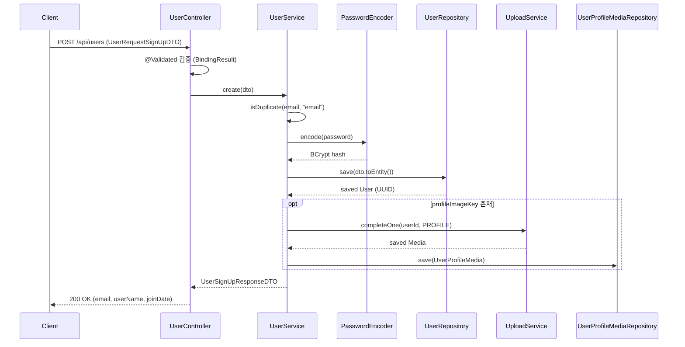

# 09. 사용자(User) 도메인 상세 분석

> 분석 대상: `src/main/java/com/example/HonBam/userapi/` (api, dto, entity, repository, service)
> 기준: Spring Boot 2.7 / Spring Data JPA / Spring Security
> 근거 표기 규칙: 모든 발견사항은 `파일:라인` 으로 원본 코드를 재확인했으며 `CONFIRMED`(코드로 직접 확인) / `PLAUSIBLE`(정황상 합리적 추론)로 구분한다.

---

## 1. 개요

사용자 도메인은 HonBam 서비스의 **계정 생명주기 전반**을 담당한다.

- **회원가입**: 이메일/비밀번호 기반 로컬 가입. 비밀번호는 BCrypt 인코딩 후 저장한다.
- **중복 검사**: 이메일(`email`)과 닉네임(`userId` 키)에 대한 사전 중복 체크 API 제공.
- **프로필**: 가입 시 S3 업로드된 프로필 이미지 키를 `Media`로 완료 처리하고 `UserProfileMedia`로 사용자와 1:1 연결. 조회 시 Presigned URL 또는 외부(카카오) URL을 반환.
- **탈퇴**: `userId`(UUID 식별자) 기준으로 사용자 엔티티를 삭제.
- **프리미엄 승급**: `ROLE_COMMON` 사용자를 `Role.PREMIUM` 으로 등급 변경.

회원의 식별자는 계정명/이메일이 아니라 **UUID 문자열 PK(`id`)** 이며, 인증 컨텍스트(`TokenUserInfo.getUserId()`)도 이 UUID를 사용한다.

---

## 2. 구성 요소

| 구분 | 파일 경로 | 역할 |
| --- | --- | --- |
| 엔티티 | `userapi/entity/User.java` | 회원 핵심 엔티티. UUID PK, 이메일 unique, 권한/구독상태/로그인제공자, `ChatRoomUser` 1:N 보유 |
| 엔티티 | `userapi/entity/UserProfileMedia.java` | 사용자 ↔ 프로필 `Media` 연결 엔티티(1:1 user, N:1 media) |
| Enum | `userapi/entity/Role.java` | `COMMON`, `PREMIUM`, `ADMIN` 권한 |
| Enum | `userapi/entity/LoginProvider.java` | `LOCAL`, `KAKAO`, `NAVER`, `GOOGLE` + `from(registrationId)` 팩토리 |
| Enum | `userapi/entity/SubscriptionStatus.java` | `EXPIRED`, `ACTIVE` 구독 상태 |
| Enum | `userapi/entity/UserPay.java` | `NORMAL`, `PREMIUM` (도메인 내에서 미참조) |
| 리포지토리 | `userapi/repository/UserRepository.java` | `findByEmail`, `existsByEmail`, `existsByNickname`, `findAllByIdNot`, `findByIdWithLock`(비관적 락) |
| 리포지토리 | `userapi/repository/UserProfileMediaRepository.java` | `findByUser`, `findByUser_IdIn`(배치 조회) |
| 서비스 | `userapi/service/UserService.java` | 가입/중복검사/승급/탈퇴/프로필 URL/유저정보 비즈니스 로직 |
| 컨트롤러 | `userapi/api/UserController.java` | `/api/users` REST 엔드포인트 |
| 요청 DTO | `userapi/dto/request/UserRequestSignUpDTO.java` | 가입 입력(`@Email`, 비번 8~20, 이름 2~6) + `toEntity()` |
| 응답 DTO | `userapi/dto/response/UserSignUpResponseDTO.java` | 가입 결과(email, userName, joinDate) |
| 응답 DTO | `userapi/dto/response/UserInfoResponseDTO.java` | 유저 정보(id, userName, address, phone, nickname, role, email) |

---

## 3. API 엔드포인트

기준 경로: `@RequestMapping("/api/users")` (`UserController.java:24`)

| 메서드 | 경로 | 인증/인가 | 요약 | 근거 |
| --- | --- | --- | --- | --- |
| `GET` | `/api/users/check` | 비인증 | `target`(필드명)·`value`(값)로 이메일/닉네임 중복 여부 boolean 반환 | `UserController.java:30-38` |
| `POST` | `/api/users` | 비인증 | 회원가입. `@Validated` 검증 실패 시 `fieldError`, 중복 시 400, 기타 500 | `UserController.java:41-58` |
| `PUT` | `/api/users/paypromote` | `@PreAuthorize("hasRole('ROLE_COMMON')")` | 인증 사용자를 `PREMIUM` 등급으로 승급, `LoginResponseDTO` 반환 | `UserController.java:61-76` |
| `GET` | `/api/users/profile-image` | 인증(`@AuthenticationPrincipal`) | 프로필 이미지 URL을 `{"profileUrl": ...}` 형태로 반환(없으면 빈 문자열) | `UserController.java:79-99` |
| `DELETE` | `/api/users/delete` | 인증(`@AuthenticationPrincipal`) | 회원 탈퇴 처리 후 안내 메시지 반환 | `UserController.java:103-114` |
| `GET` | `/api/users/userinfo` | 인증(`@AuthenticationPrincipal`) | 로그인 사용자 상세 정보(`UserInfoResponseDTO`) 반환 | `UserController.java:117-121` |

> 참고: 로그(`log.info`) 다수가 `/api/auth ...` 로 표기되어 있으나 실제 매핑은 `/api/users` 이다(복붙 잔재로 추정, `UserController.java:43,64,81,105`).

---

## 4. 데이터 흐름

### (a) 회원가입 — 중복검사 → BCrypt 인코딩 → 저장
1. 컨트롤러 `signUp` 에서 `@Validated` 로 이메일 형식/비번 길이/이름 길이 검증(`UserController.java:42-47`).
2. `UserService.create`:
   - `isDuplicate(email, "email")` 호출 후 중복 시 `DuplicateEmailException`(`UserService.java:45-48`). **단, 인자 순서 문제로 이 검사가 실제로는 작동하지 않음 → 6장 발견사항 참고.**
   - `passwordEncoder.encode(dto.getPassword())` 로 BCrypt 인코딩 후 DTO에 다시 set(`UserService.java:50-51`).
   - `dto.toEntity()` → `userRepository.save(...)`(`UserService.java:53`). 이때 `User` 빌더 기본값으로 `role=COMMON`, `subscriptionStatus=EXPIRED`, `loginProvider=LOCAL` 이 채워진다.
   - `profileImageKey` 가 있으면 `linkProfileImage` 수행(`UserService.java:56-58`).
3. `UserSignUpResponseDTO(saved)` 반환(email/userName/joinDate).

### (b) 프로필 이미지 연결 (UserProfileMedia ↔ Media)
1. `linkProfileImage(user, fileKey)`(`UserService.java:64-87`).
2. `UploadCompleteRequest`(purpose=`PROFILE` 고정) 생성 → `uploadService.completeOne(userId, req)` 로 `Media` 영속화(`UserService.java:67-73`).
3. `UserProfileMedia.builder().user(user).media(savedMedia).build()` → `userProfileMediaRepository.save(...)`(`UserService.java:76-81`).
4. 예외 시 `RuntimeException("프로필 설정 중 오류 발생")` 으로 변환(`UserService.java:83-86`).
5. 조회(`getProfileUrl`)는 `findByUser` 로 `UserProfileMedia` 를 찾아 `media.getFileKey()` 가 `http` 로 시작하면 외부 URL 그대로, 아니면 Presigned GET URL 생성(`UserService.java:122-137`).

### (c) 프리미엄 승급
`promoteToPayPremium(userId)`(`UserService.java:99-106`): `findById` → `changeRole(Role.PREMIUM)` → `save` → `tokenProvider.createAccessToken(saved)` 호출. **단, 생성한 토큰을 사용하지 않고 `new LoginResponseDTO(saved)` 만 반환** → 6장 참고.

### 핵심 흐름 (회원가입) — Mermaid

---

## 5. 영속성 / 연관관계

| 항목 | 매핑 | 근거 |
| --- | --- | --- |
| PK | `String id`, `@GeneratedValue(generator="system-uuid")` + `@GenericGenerator(strategy="uuid")` → UUID 문자열 | `User.java:23-27` |
| 테이블 | `@Table(name = "hb_user")` | `User.java:20` |
| email | `@Column(nullable=false, unique=true)` | `User.java:29-30` |
| password | `@Column(nullable=false)`, BCrypt 인코딩 값 저장 | `User.java:36-37` |
| userName | `@Column(nullable=false)` | `User.java:39-40` |
| subscriptionStatus | `@Enumerated(STRING)` + `@Builder.Default = EXPIRED`, `@Setter` 존재 | `User.java:44-47` |
| joinDate | `@CreationTimestamp` 자동 생성 | `User.java:49-50` |
| role | `@Enumerated(STRING)` + `@Builder.Default = COMMON` | `User.java:52-54` |
| loginProvider | `@Enumerated(STRING)` + `@Column(nullable=false)` + `@Builder.Default = LOCAL` | `User.java:58-61` |
| accessToken | 카카오 로그인 accessToken 저장(로그아웃용), 평문 필드 | `User.java:56` |
| chatRoomUsers | `@OneToMany(mappedBy="user", cascade=ALL, orphanRemoval=true)`, `@ToString.Exclude` | `User.java:64-67` |
| UserProfileMedia.user | `@OneToOne(fetch=LAZY, optional=false)` `@JoinColumn(name="user_id", nullable=false)` | `UserProfileMedia.java:24-26` |
| UserProfileMedia.media | `@ManyToOne(fetch=LAZY, optional=false)` `@JoinColumn(name="media_id", nullable=false)` | `UserProfileMedia.java:28-30` |
| UserProfileMedia.createdAt | `@CreationTimestamp` | `UserProfileMedia.java:32-33` |

도메인 메서드: `changeRole`, `changeUserName`, `changeLoginProvider` (`User.java:71-81`). 식별자 기반 동등성 `@EqualsAndHashCode(of = "id")`(`User.java:15`).

`UserProfileMedia` 는 `User` 측에서 역방향 매핑/캐스케이드를 보유하지 않는다(연관은 `UserProfileMedia` → `User` 단방향 FK).

---

## 6. 발견사항

### F-1. 회원가입 중복검사가 실질적으로 동작하지 않음 — `CONFIRMED`
- `UserService.create` 는 `isDuplicate(email, "email")` 로 호출한다(`UserService.java:45`).
- `isDuplicate(String target, String value)` 는 **첫 번째 인자를 키("email"/"userId")로, 두 번째를 값으로** 분기한다(`UserService.java:89-96`). 즉 `target.equals("email")` 를 검사하는데, 여기서 `target` 에는 실제 이메일 주소가 들어온다.
- 따라서 `create` 경로에서는 `target.equals("userId")`/`target.equals("email")` 모두 false → 항상 `return false` 가 되어 `DuplicateEmailException` 분기는 **죽은 코드**가 된다.
- 반면 `UserController.check`(`UserController.java:35`)는 `isDuplicate(target, value)`(키, 값) 순서로 올바르게 호출되어 정상 동작한다.
- 결과: 가입 시점 중복 차단은 사실상 DB의 `email unique` 제약(`User.java:29`)에만 의존하며, 위반 시 `RuntimeException` 캐치로 "이메일 중복!" 처리(`UserController.java:51-53`)된다. 의도된 `DuplicateEmailException` 흐름과 불일치.

### F-2. 승급 시 생성한 토큰을 사용하지 않음 — `CONFIRMED`
- `promoteToPayPremium` 에서 `String token = tokenProvider.createAccessToken(saved);` 로 토큰을 만들지만 이후 사용하지 않고 `new LoginResponseDTO(saved)` 만 반환한다(`UserService.java:104-105`). 갱신된 권한이 반영된 토큰을 클라이언트로 내려주려던 의도로 보이나 누락됨(`token` 미사용 지역 변수).

### F-3. 탈퇴 시 프로필 미디어 연관 정리 누락 가능성 — `PLAUSIBLE`
- `delete` 는 `userRepository.delete(user)` 만 수행한다(`UserService.java:109-113`).
- `User` 의 `chatRoomUsers` 는 `cascade=ALL, orphanRemoval=true`(`User.java:65`)로 함께 삭제되나, `UserProfileMedia` 는 `User` 측에 역방향 캐스케이드가 없고 `user_id` 가 `nullable=false` FK(`UserProfileMedia.java:24-26`)이다.
- 프로필 미디어가 존재하는 사용자를 삭제하면 `user_profile_media.user_id` FK 제약 위반으로 삭제가 실패할 수 있다(DB FK 정책에 따라 다름). 컨트롤러는 이를 500으로 응답(`UserController.java:109-113`). 연관 `Media`/S3 객체 정리 로직도 부재.

### F-4. 비밀번호 인코딩은 정상, 단 DTO 재사용 — `CONFIRMED`
- `passwordEncoder.encode(...)` 로 BCrypt 인코딩 후 저장하는 흐름은 올바르다(`UserService.java:50-51,53`). 다만 인코딩 결과를 **요청 DTO에 다시 set** 하여(`dto.setPassword(encoded)`) 입력 객체를 변형한다. 기능상 문제는 없으나 입력 DTO 가변화는 부작용 유발 소지가 있다.

### F-5. 프로필 미디어 정합성 — `PLAUSIBLE`
- `UserProfileMedia` 는 사용자당 1건을 가정(`@OneToOne`, `findByUser` 단건 반환, `UserProfileMedia.java:24`, `UserProfileMediaRepository.java:14)`)하지만, 유니크 제약은 `@JoinColumn` 에 명시되어 있지 않다. 가입 외 경로에서 프로필을 재등록하면 동일 사용자에 복수 행이 생길 수 있고, 그 경우 `findByUser` 가 `NonUniqueResult` 로 실패할 위험이 있다(현재 도메인에는 갱신 경로가 보이지 않음).
- `getProfileUrl` 은 `fileKey` 가 `http` 로 시작하면 외부 URL로 간주(카카오 프로필 대응)하고 그 외에는 Presigned URL을 생성한다(`UserService.java:128-134`). 외부 URL 판단을 prefix 문자열로만 처리한다.

### F-6. 미사용/잠재적 혼동 요소 — `CONFIRMED`
- `UserPay` enum(`NORMAL`, `PREMIUM`)은 user 도메인 내에서 참조되지 않는다(`UserPay.java`). 등급 구분은 실제로 `Role`(`COMMON/PREMIUM/ADMIN`)로 수행된다.
- 승급(`promoteToPayPremium`)은 `Role` 만 변경하고 `subscriptionStatus`(EXPIRED/ACTIVE)는 건드리지 않는다(`UserService.java:102`). "구독 상태"와 "권한 등급"이 별개로 관리되며 승급 시 동기화되지 않는다.
- 컨트롤러 로그 경로 표기가 실제 매핑(`/api/users`)과 다른 `/api/auth ...` 로 남아 있다(`UserController.java:43,64,81,105`).
