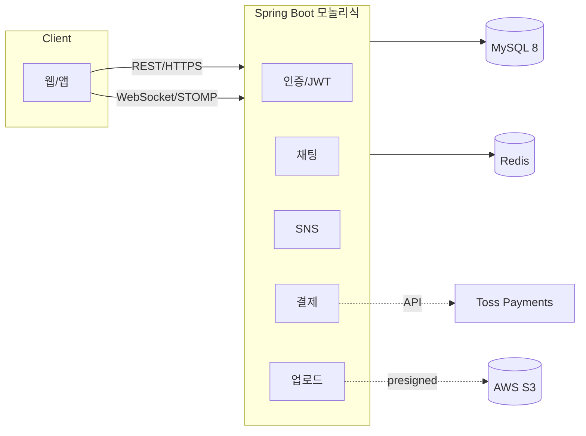
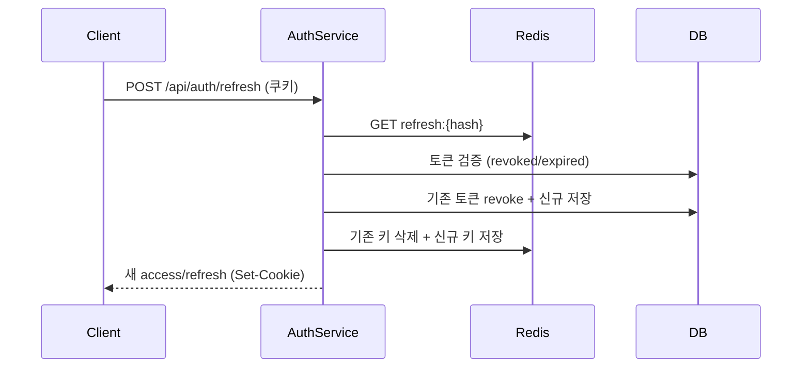
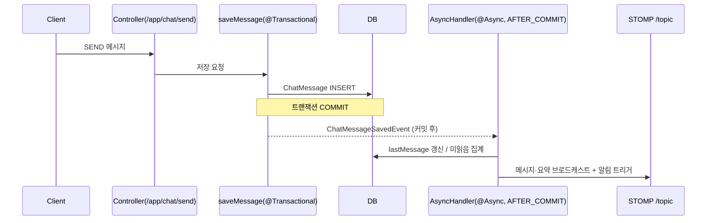
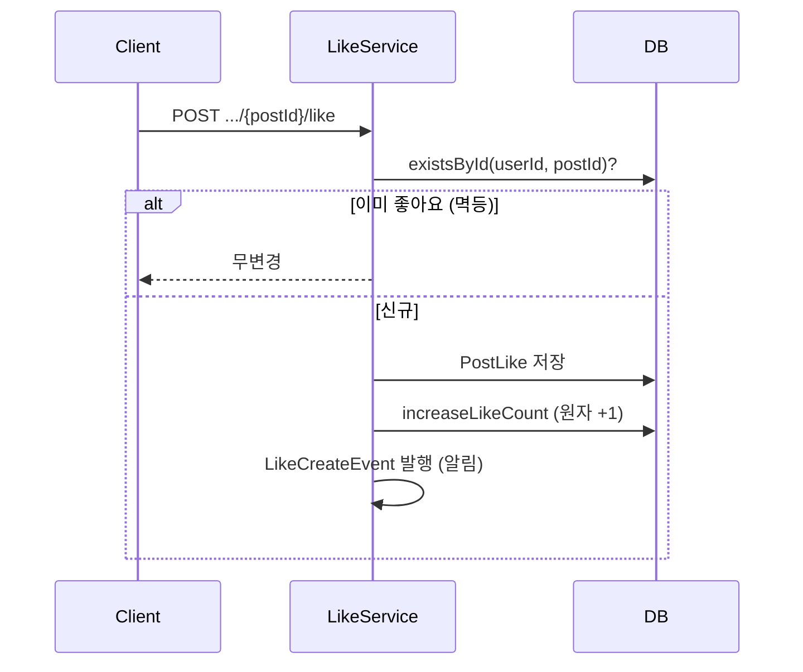
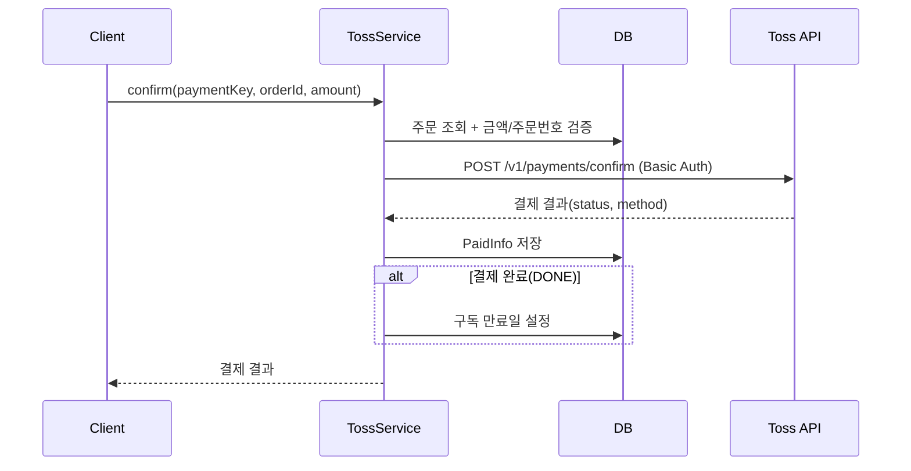
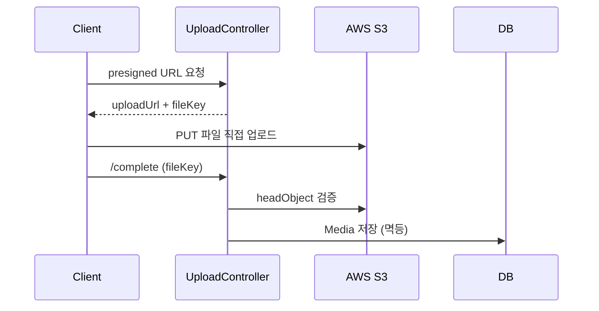
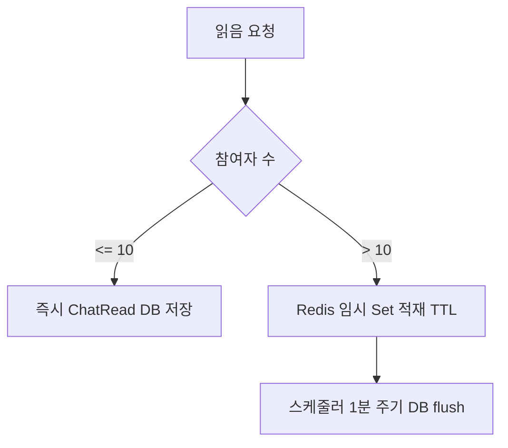

# HonBam-api 포트폴리오 — 발표용 슬라이드 구성안

> 신입 백엔드 개발자 지원용 · 발표 슬라이드 9장(7~10장 가변) 원고
> 각 장: **핵심 메시지(1줄) / 슬라이드 본문(불릿) / 시각자료 / 발표 스크립트 / 예상 Q&A**
> `〔채워넣기〕`는 개인정보·맥락이라 사용자가 입력. 시각자료 Mermaid는 슬라이드 작도용으로 단순화했고, 상세 버전은 `docs/analysis/*` 참조.
> ⚠️ 정직성 원칙: 미완 기능(멀티 인스턴스 동기화·RabbitMQ relay·구독 만료 스케줄러)은 **S9 향후 개선**에만 등장. 완료 성과로 서술 금지.

---

## S1 — 표지 / 프로젝트 개요

**핵심 메시지:** "홈텐딩 소셜 플랫폼의 백엔드를 8개 도메인·실시간 채팅까지 직접 설계·구현했습니다."

**슬라이드 본문**
- 프로젝트명: **HonBam API Server** — 홈텐딩(홈 칵테일) 문화 소셜 플랫폼 API
- 지원자: 〔이름 / 한 줄 소개〕 · 기간: 〔YYYY.MM ~ YYYY.MM〕 · 팀: 〔개인 / N명 중 백엔드〕
- 담당: 〔예: 인증·채팅·결제 도메인 설계 및 구현〕
- 기술스택 배지: `Spring Boot 2.7` · `Java 11` · `JPA / MySQL 8` · `Spring Security / JWT` · `WebSocket(STOMP)` · `Redis` · `AWS S3` · `Toss Payments`
- 핵심 수치: **8개 도메인**, 핵심 기능 5종(인증 · 실시간 채팅 · SNS · 결제 · 미디어 업로드)

**시각자료:** 표지(프로젝트명 + 한 줄 소개) + 하단 기술스택 아이콘 행

**발표 스크립트:** "안녕하세요, 〔이름〕입니다. 제가 〔기간〕 동안 진행한 HonBam API 서버를 소개하겠습니다. 홈 칵테일을 즐기는 사용자들이 모여 글을 쓰고 실시간으로 대화하는 소셜 플랫폼의 백엔드이고, 인증부터 실시간 채팅·결제까지 8개 도메인을 다뤘습니다. 오늘은 그중 핵심 5개 기능을 중심으로 설계 의도와 고민을 말씀드리겠습니다."

**예상 Q&A:** Q. 혼자 했나요, 팀이었나요? → 〔담당 범위 명확히〕 / Q. 왜 이 주제인가요? → 〔동기〕

---

## S2 — 아키텍처 한눈에

**핵심 메시지:** "단일 Spring Boot 애플리케이션에 MySQL·Redis·S3·WebSocket을 목적에 맞게 결합했습니다."

**슬라이드 본문**
- 구조: Client(웹/앱) → **Spring Boot(모놀리식)** → MySQL(영속) · Redis(토큰·티켓·캐시) · AWS S3(미디어)
- 실시간: WebSocket(STOMP)로 채팅/알림 푸시
- 기술 선택 이유(1줄): JWT=무상태 인증 / Redis=토큰·티켓·짧은 TTL 데이터 / presigned=파일을 서버 경유 없이 S3 직접 업로드
- 공통 설계 패턴: **이벤트 기반 비동기** — 핵심 경로(저장)만 동기, 부가 작업(알림·집계·브로드캐스트)은 `@Async` + `@TransactionalEventListener(AFTER_COMMIT)`로 분리

**시각자료 (아키텍처 다이어그램):**

**발표 스크립트:** "전체 구조는 하나의 Spring Boot 애플리케이션을 중심으로, 영속 데이터는 MySQL, 토큰·티켓처럼 수명이 짧은 데이터는 Redis, 이미지·영상은 S3에 둡니다. 실시간 통신은 WebSocket STOMP를 씁니다. 제가 가장 신경 쓴 공통 패턴은 '이벤트 기반 비동기'인데요, 사용자 응답에 꼭 필요한 저장만 동기로 처리하고 알림·집계 같은 부가 작업은 트랜잭션 커밋 이후 비동기로 분리해 응답 지연을 줄였습니다."

**예상 Q&A:** Q. 왜 모놀리식인가요? → 규모·학습 목적상 단일 배포가 적합, 도메인은 패키지로 분리 / Q. 비동기에서 트랜잭션은 어떻게 보장? → AFTER_COMMIT으로 롤백 시 유령 이벤트 방지(S4에서 상세)

---

## S3 — 인증/인가 (JWT + OAuth2) 〔필수〕

**핵심 메시지:** "Access는 JWT, Refresh는 회전(rotation)하는 난수 토큰으로 — 탈취 대응까지 고려한 인증을 만들었습니다."

**슬라이드 본문**
- **Access Token**: JWT(HS512), 무상태 검증 / **Refresh Token**: 난수, DB+Redis 이중 저장
- **토큰 회전**: refresh 사용 시 기존 토큰 revoke + 신규 발급 → 재사용 차단
- 소셜 로그인(Kakao/Naver) + 로컬 로그인, 토큰은 **httpOnly 쿠키**로 전달
- 필터 체인: `JwtAuthFilter`(검증) → `JwtExceptionFilter`(에러 응답 표준화)
- 장애 대응: refresh 조회 시 Redis 우선, 장애 시 DB 폴백

**시각자료 (Refresh 토큰 회전 — 단순화):**

**발표 스크립트:** "인증은 Access와 Refresh를 분리했습니다. Access는 JWT라 서버가 상태를 들고 있지 않아도 검증되고, Refresh는 난수로 만들어 DB와 Redis에 저장합니다. 핵심은 회전인데요, Refresh로 재발급할 때마다 기존 토큰을 폐기하고 새로 발급해서, 탈취된 토큰이 재사용되는 걸 막습니다. 토큰은 httpOnly 쿠키로 내려 XSS에서 비교적 안전하게 했습니다."

**예상 Q&A:** Q. 왜 Refresh를 JWT로 안 했나요? → 서버가 폐기(revoke)를 제어해야 회전이 의미 있어서 / Q. Access 만료는 어떻게 처리? → 필터에서 만료를 구분해 `ACCESS_TOKEN_EXPIRED` 응답, 클라가 refresh 호출 *(주: 실제 구현에 만료 메시지 매칭 이슈가 있어 보완 중이라 솔직히 답하면 가점)*

---

## S4 — 실시간 채팅 (WebSocket/STOMP) 〔필수 · 핵심 어필〕

**핵심 메시지:** "WebSocket 인증을 '티켓'으로 분리하고, 메시지 저장과 부가 처리를 비동기로 나눠 응답을 가볍게 했습니다."

**슬라이드 본문**
- **WS 티켓 인증 분리**: HTTP(JWT)로 1회용 티켓 발급 → Redis 저장(TTL 30s) → STOMP CONNECT에서 1회 검증·즉시 폐기. 핸드셰이크에서 무거운 인증 제거
- **이벤트 기반 비동기**: 메시지 INSERT만 핵심 경로, 브로드캐스트·알림·미읽음 집계는 커밋 후 비동기
- 1:1 / 그룹 / 오픈 채팅, 커서 기반 페이징
- 미디어 첨부 메시지는 presigned URL로 조회

**시각자료 (메시지 송신 흐름 — 단순화):**

**발표 스크립트:** "채팅에서 두 가지를 가장 고민했습니다. 첫째, WebSocket 핸드셰이크마다 JWT를 검증하면 무거워서, HTTP 단계에서 30초짜리 1회용 티켓을 발급받아 CONNECT 때 한 번만 검증하도록 인증을 분리했습니다. 둘째, 메시지를 보낼 때 저장만 동기로 하고, 브로드캐스트·알림·안 읽은 수 계산은 트랜잭션 커밋 이후 비동기로 처리해 사용자 응답을 빠르게 했습니다."

**예상 Q&A:** Q. 티켓을 30초로 한 이유? → 발급 직후 CONNECT만 허용하면 충분, 노출 창 최소화 / Q. AFTER_COMMIT을 쓴 이유? → 저장이 롤백되면 알림도 안 나가야 해서(데이터 정합성)

---

## S5 — SNS (게시글/댓글/좋아요/팔로우) 〔필수〕

**핵심 메시지:** "좋아요·댓글 수를 비정규화 카운터로 두고 원자적 UPDATE로 동시성을, 2단계 조회로 N+1을 잡았습니다."

**슬라이드 본문**
- 게시글 CRUD + 댓글(대댓글 1단계) + 좋아요 + 팔로우
- **비정규화 카운터**: `likeCount`/`commentCount`를 `@Modifying UPDATE`로 원자 증감(매번 COUNT 쿼리 회피 + 동시성 고려)
- **2단계 조회**: ID만 페이징 → fetch join 재조회로 N+1 회피
- **멱등 처리**: 좋아요/팔로우는 복합키(`@EmbeddedId`)로 중복 차단
- 알림은 이벤트로 분리(좋아요/팔로우 → `notification`)

**시각자료 (좋아요 흐름 — 단순화):**

**발표 스크립트:** "SNS에서는 좋아요·댓글 수를 조회할 때마다 COUNT를 날리면 비효율이라, 게시글에 카운터 컬럼을 두고 UPDATE 한 줄로 원자적으로 증감했습니다. 또 피드를 불러올 때 연관 데이터까지 한 번에 가져오면 N+1이 터져서, ID만 먼저 페이징하고 fetch join으로 다시 조회하는 2단계 방식으로 해결했습니다. 좋아요·팔로우는 복합키로 중복을 막아 멱등하게 동작합니다."

**예상 Q&A:** Q. 카운터가 실제 행 수와 어긋나면? → 드리프트 가능성 인지, 배치 보정 또는 트랜잭션 일치가 개선 포인트(솔직히) / Q. fetch join 페이징 주의점? → 컬렉션 fetch join + 페이징은 메모리 페이징 위험, 그래서 ID 페이징 선행

---

## S6 — 결제 (Toss Payments) 〔필수〕

**핵심 메시지:** "Toss 결제 승인·취소와 구독 모델을 연동하고, 금액·주문번호 검증으로 위변조를 막았습니다."

**슬라이드 본문**
- 결제 승인(confirm) / 취소(cancel) / 가상계좌 분기
- 흐름: 주문 임시정보(PaymentInfo) 저장 → Toss confirm 호출 → 결제완료(PaidInfo) 저장 → 구독 만료일(SubscriptionInfo) 설정
- **보안**: Secret Key를 Base64 Basic 인증 헤더로, 서버에서 **금액·주문번호 재검증**(클라 값 신뢰 안 함)
- 구독: Subscription / SubManagement / SubscriptionInfo 모델로 기간 합산

**시각자료 (결제 confirm — 단순화):**

**발표 스크립트:** "결제는 Toss 위젯과 연동했습니다. 핵심은 클라이언트가 보낸 금액을 그대로 믿지 않고, 서버에 저장해 둔 주문 정보와 금액·주문번호를 대조한 뒤에야 Toss 승인 API를 호출한다는 점입니다. 승인이 완료되면 결제 정보를 저장하고 구독 만료일을 계산해 반영합니다. Secret Key는 노출되지 않도록 서버에서만 Basic 인증 헤더로 사용합니다."

**예상 Q&A:** Q. 중복 결제/멱등은? → orderId 기준 검증, 개선 여지 솔직히 / Q. 결제 실패·취소 정합성? → 상태 모델로 관리(현재 상태 전이 일부 미완은 개선 과제)

---

## S7 — 미디어 업로드 (S3 Presigned URL) 〔필수〕

**핵심 메시지:** "파일을 서버로 받지 않고 presigned URL로 S3에 직접 올리게 해, 서버 부하와 트래픽 비용을 줄였습니다."

**슬라이드 본문**
- **3단계**: ① presigned PUT URL 발급(서버) → ② 클라이언트가 S3로 직접 업로드 → ③ `/complete` 콜백에서 서버가 검증 후 메타데이터(Media) 저장
- 완료 검증: S3 `headObject`로 실제 존재·contentType 확인 후 용도별 정책 검증(PROFILE=이미지 / POST=이미지·영상)
- **멱등**: `fileKey` 유니크 + 선검사로 중복 저장 방지
- 조회도 presigned GET URL(만료 60분)로 비공개 객체 안전 제공

**시각자료 (presigned 업로드 — 단순화):**

**발표 스크립트:** "업로드는 파일을 서버가 직접 받으면 트래픽과 메모리 부담이 커서, presigned URL 방식을 택했습니다. 서버는 업로드용 URL만 발급하고, 클라이언트가 S3로 바로 올린 뒤 완료 콜백을 보내면 서버가 실제 객체와 타입을 검증하고 메타데이터만 DB에 저장합니다. 같은 파일키로 중복 저장되지 않도록 멱등하게 만들었습니다."

**예상 Q&A:** Q. 검증이 업로드 뒤라 잘못된 파일이 S3에 남지 않나요? → 맞습니다, 고아 객체 정리(라이프사이클 정책)가 개선 포인트(솔직히) / Q. 비공개 이미지는 어떻게 보여주나요? → 조회용 presigned GET URL(만료 60분)

---

## S8 — 트러블슈팅 (2건 깊게)

**핵심 메시지:** "동시성과 쓰기 부하라는 두 실전 문제를, 트랜잭션 범위 축소와 처리 분기로 풀었습니다."

**T1. 채팅방 `lastMessage` 갱신 경합**
- 문제: 같은 방에 동시 전송 시 동일 row를 동시 UPDATE → lock wait / 정합성 우려
- 원인: 메시지 저장 트랜잭션이 길고 부가 작업까지 한 트랜잭션에 묶임
- 해결: ① 저장 트랜잭션 범위 축소 + 부가 작업 비동기 분리 ② `lastReadMessageId`는 **더 큰 값일 때만** 갱신(단조 증가, 순서 역전 방지) ③ 1:1 방 생성은 비관적 락으로 중복 방지
- 결과: 동시 전송 시 경합 완화, 응답 지연 감소

**T2. 대형 채팅방 읽음 처리 쓰기 부하**
- 문제: 참여자 많은 방에서 읽음 기록(ChatRead)이 메시지마다 폭증
- 해결: **참여자 수로 분기** — 10명 이하는 즉시 DB 저장, 초과 시 Redis 임시 Set에 적재(TTL) 후 **스케줄러가 1분 주기로 DB flush**
- 결과: 순간 쓰기 폭증을 분산, DB 부하 완화

**시각자료 (읽음 처리 분기):**

**발표 스크립트:** "운영 관점에서 두 문제를 다뤘습니다. 첫째, 같은 방에 메시지가 동시에 오면 방의 마지막 메시지 갱신이 충돌했는데, 저장 트랜잭션을 짧게 줄이고 부가 작업을 비동기로 빼고, 읽음 위치는 더 큰 값일 때만 갱신하도록 해 순서 역전과 경합을 줄였습니다. 둘째, 큰 방에서 읽음 기록이 폭증하는 문제는 참여자 수로 분기해서, 큰 방은 Redis에 모았다가 스케줄러가 주기적으로 DB에 반영하도록 부하를 분산했습니다."

**예상 Q&A:** Q. Redis에 모았다가 flush 전에 장애 나면? → TTL·재처리 설계 필요, 현재 단순 flush라 내구성 보강이 과제(솔직히) / Q. 비관적 락 성능 영향? → 1:1 방 생성처럼 드문 경로에만 한정 적용

---

## S9 — 회고 / 배운 점 / 향후 개선

**핵심 메시지:** "동작하는 것을 넘어 '왜 이렇게 설계했는가'를 고민했고, 한계도 명확히 알고 있습니다."

**슬라이드 본문 — 배운 점**
- 이벤트 기반 비동기로 핵심 경로와 부가 작업을 분리하는 설계 감각
- 토큰 회전·presigned 같은 보안·부하 관점의 패턴
- 동시성(원자적 UPDATE, 조건부 갱신, 락)과 N+1 같은 실전 이슈 대응

**슬라이드 본문 — 향후 개선 (정직하게)**
- **멀티 인스턴스 확장**: 현재 단일 인스턴스 기준. 채팅 읽음 상태의 인스턴스 간 동기화(Redis Pub/Sub 발행 경로 보완) 또는 RabbitMQ STOMP relay 도입 필요
- **구독 만료 자동화**: 만료 스케줄러 로직 활성화
- **테스트 보강**: 현재 채팅 위주 → 도메인 단위·통합 테스트 확대
- **운영**: 고아 객체 정리(S3 라이프사이클), DDL 마이그레이션 도구 도입

**발표 스크립트:** "이 프로젝트로 단순히 기능을 만드는 걸 넘어, 왜 이 구조인지를 설명할 수 있게 된 게 가장 큰 수확입니다. 동시에 한계도 분명히 알고 있는데요, 지금은 단일 서버 기준이라 여러 대로 확장하려면 채팅 읽음 상태 동기화나 메시지 브로커를 보완해야 하고, 테스트 커버리지도 채팅 위주라 도메인 전반으로 넓혀야 합니다. 이런 개선점을 알고 다음 단계를 계획하고 있다는 점을 말씀드리고 싶습니다. 감사합니다."

**예상 Q&A:** Q. 가장 어려웠던 점? → 〔본인 경험〕 / Q. 다시 만든다면? → 〔테스트 우선/모듈 분리 등〕

---

## 부록 A — 기술스택 배지(슬라이드용 텍스트)

`Java 11` `Spring Boot 2.7` `Spring Security` `JWT(jjwt)` `Spring Data JPA` `MySQL 8` `Redis` `WebSocket / STOMP` `AWS S3` `Toss Payments` `OAuth2(Kakao/Naver)` `Docker` `Gradle` `Swagger`

## 부록 B — 한 줄 자기소개 3안

1. "설계 의도를 설명할 수 있는 백엔드 개발자 — 실시간 채팅과 인증을 직접 구현했습니다."
2. "동시성·N+1·부하 분산 같은 실전 문제를 고민하며 만든 소셜 플랫폼 API."
3. "동작하는 코드를 넘어 한계와 개선점까지 아는 신입 백엔드입니다."

## 부록 C — 발표 타임라인

- **5분 버전**: S1(30s) · S2(40s) · S3·S4(각 60s) · S5~S7 묶어 60s · S8(60s) · S9(30s)
- **7분 버전**: 전 슬라이드 균등 + S4·S8에 시간 가중

## 부록 D — 장수 조절 가이드

- **7장 압축**: S5~S7을 "주요 기능(SNS·결제·업로드)" 1~2장으로 묶기, S8·S9 유지
- **10장 확장**: S2 뒤에 **ERD/데이터 모델** 1장 추가, S8 트러블슈팅을 T1·T2 각 1장으로 분리

## 부록 E — 사용자 입력 필요 항목 체크리스트

- [ ] 이름 / 연락처 / GitHub·블로그 링크
- [ ] 프로젝트 기간, 팀 구성과 본인 담당 범위
- [ ] (선택) 실제 스크린샷·데모 GIF, 트래픽/성능 측정값(있다면 S8 보강)
